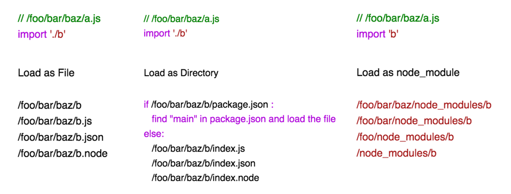

## Background

We are trying out a new form of our weekly sharing, which is interest group-based.

I am hosting the **"Building a simplified webpack clone"** interest group, which lasted 8 weeks, and every week, we will cover 1 concept of webpack and an assignment to implement that concept ourselves.

## Prior Art
 
- 📺 [Tobias Koppers](https://twitter.com/wSokra) - bundling live by hand - https://youtube.com/watch?v=UNMkLHzofQI
- 📺 [Ronen Amiel](https://twitter.com/ronenamiel) - build your own webpack - https://youtube.com/watch?v=Gc9-7PBqOC8
- 📖 adam kelly - https://freecodecamp.org/news/lets-learn-how-module-bundlers-work-and-then-write-one-ourselves-b2e3fe6c88ae/

## Week 1 - Resolving

### Why module bundler?

We love writing small modular JS files, but that shouldn't impact the users.

Traditionally with limit on number of request connection, 🐌 slow internet speed, we want to combine all the code into 1 file -> 1 network request


🕰 Traditionally, we concatenate the source files into 1 big output file.

But that begs the question
- ❓ what should be the order of concatenation (files may depend on each other) ?
- ❓ what if there's var naming conflict across files?
- ❓ what if there's unused file?

💡 That's why we need a module system to define the relationship among the JS modules


So now, let's take a look how we can start building a module dependency graph

### 1. We start from an entry file.

This is the starting point of the application

### 2. We read the file and determine what is being imported into this file

```js
import calculate from './calculate';
import { measure, UNITS } from '../measurements';
import formula from 'formulas';

const oneCm = measure(1, UNITS.CM);
const result = calculate(formula, oneCm);
```

In the example above, the following is imported:

- `'./calculate'`
- `'../measurements'`
- `'formulas'`

we can spot the import from our human eye 👀, but how can computer 🤖 do that for us?

🤖 can parse the code in string into Abstract Syntax Tree (AST), something representing the code that 🤖 can understand.

in AST, import statement is represented by a node with:

- `type` = "ImportDeclaration"
- `source.value` = the filename it's trying to import


There are various JavaScript parser out there, here are some of them

- 🔗 [babel](https://babeljs.io/docs/en/babel-core)
- 🔗 [acorn](https://github.com/acornjs/acorn)
- 🔗 [esprima](https://github.com/jquery/esprima)
- 🔗 [es-module-lexer](https://github.com/guybedford/es-module-lexer)

```js
// babel
const babel = require('@babel/core');
babel.parseSync(code);

// acorn
const acorn = require('acorn');
acorn.parse(code, { ecmaVersion: 2020, sourceType: 'module' });

// esprima
const esprima = require('esprima');
esprima.parseScript(code);

// if you just need the import & export
// es-module-lexer is blazing fast, it is written in c, and loaded through web-assembly
// is what powers vite for parsing dependencies
const { init, parse } = require('es-module-lexer');
await init;
const [imports, exports] = parse(code);
```

...and if you forgot about your tree-traversal algorithm 😨, here are some libraries that can help you out

- 🔗 [babel-traverse](https://babeljs.io/docs/en/babel-traverse)
- 🔗 [acorn-walk](https://github.com/acornjs/acorn/tree/master/acorn-walk)
- 🔗 [estree-walker](https://github.com/Rich-Harris/estree-walker)

```js
// babel
const traverse = require("@babel/traverse").default;
traverse(ast, {
  ImportDeclaration(node) {}
});

// acorn
walk.simple(ast, {
  ImportDeclaration(node) {}
});

// estree-walker
const { walk } = require( 'estree-walker' );
walk(ast, {
   enter(node) { },
   leave(node) { }
});
```

Some other useful links
- Inspect your AST
  - https://astexplorer.net
  - https://lihautan.com/babel-ast-explorer/
- The JS AST Specification
  - https://github.com/estree/estree
- Guide on parsing, traversing AST
  - https://lihautan.com/manipulating-ast-with-javascript
  - https://lihautan.com/json-parser-with-javascript

### 3. Now knowing what are the names you are importing from, you need to figure out their actual file path

that depends on
- the current file path
- the name you are importing from

```js
resolve('a/b/app.js', './calculate.js');
// a/b/calculate.js
resolve('a/b/app.js', '../measurements.js');
// a/measurements.js
resolve('a/b/app.js', 'formulas');
// node_modules/formulas/src/index.js
```

That leads us to the [Node.js Module Resolution Algorithm](https://nodejs.org/api/modules.html#modules_all_together)
 
It describes the steps taken to resolve the file.

there are 3 scenarios in general:
- load as file
- load as directory
- load as node_modules



Some other module resolution:
- webpack uses [`enhanced-resolve`](https://github.com/webpack/enhanced-resolve) which is a highly configurable resolver
- Typescript implements its own resolver, [see how TS resolving works](https://typescriptlang.org/docs/handbook/module-resolution.html)

### 4️⃣ After you figured the file path you're importing from, for each of the file, 🔁 repeat step 2️⃣ until no more new files to be found.

### Assignment 

[Test cases](https://github.com/tanhauhau/rk-webpack-clone)

For each test cases, we provide the entry file, and we expect

📝 Module
- `filepath`
- `dependencies` -> list of Depedencies (see below 👇)
- `isEntryFile` -> `true` if it is the entry file / `false` otherwise

📝 Depedencies
- `module` (see above ☝️)
- `exports` -> list of var names you are importing, eg "default", "measure" ..

📝 If 2 module are importing the same module, both should be referring to the same module instance

```js
moduleCFromModuleA === moduleCFromModuleB
```

📝 Be careful with circular dependency 🙈