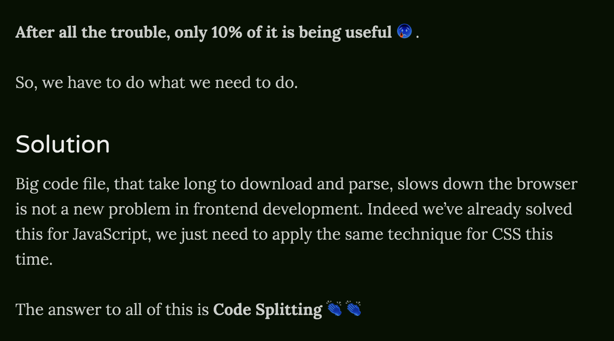

After reading Dan's [Overreacted](https://overreacted.io) & Wei's [A Work in Progress](https://dev.wgao19.cc/) a while ago, I decided to have my [own blog](https://lihautan.com/blogs) as well! _(In case you still don't know, it's the very one you are reading right now!)_

I took it as an opportunity to learn [Gatsby](https://www.gatsbyjs.org/), I've heard about it for a while, so I guess it's to know how it works.

This article is **NOT about how to build a Gatsby site**, there a lot resources about that you can go for. But I am here to share some of my customisations that I've added to my Gatsby site, and hopefully you would share yours too.

## The boilerplate

I used the exact same Gatsby starter pack as Dan's [Overreacted](https://overreacted.io), because why not ¯\_(ツ)_/¯. It looks sleek and simple and I like it.

## The light & dark mode

[Wei](https://twitter.com/wgao19) did a sharing on how mix blend mode works and how she [added night mode using mix-blend-mode](https://dev.wgao19.cc/2019-05-04__sun-moon-blending-mode/) on her site.

So I decided to add my own [Dark Mode Switch](https://github.com/tanhauhau/tanhauhau.github.io/commit/291663d10cc7838d67392acb6a28a04a655603a6#diff-4e34e842430a5e2977417f28e477e14d) as well.

The Dark Mode Switch was relatively easy. I added a pseudo-element `div#___gatsby::after` to cover over my entire Gatsby blog, so I don't have to create another div element.

```js
// filename: theme-mode.css
div#___gatsby::after {
  content: '';
  position: fixed;
  top: 0;
  bottom: 0;
  left: 0;
  right: 0;
  pointer-events: none;
  background: white;
  mix-blend-mode: difference;
}
```

It's easy and it looks great, except, all my images and emojis are inverted. 😢



I need to wrap all my emojis around a `<span>` so I can apply some css like `isolation: isolate` to exclude them from being blended. [Inspiration credits to huijing 👏👏](https://www.chenhuijing.com/blog/friends-dont-let-friends-implement-dark-mode-alone/#%F0%9F%92%BB). But I am lazy to wrap all my emojis with `<span>`, I want to use them anytime I want, without bothering much of the `<span>`, so I decided to write a gatsby remark plugin to do that for me. 😎

Well, it turns out it's not that hard.

[Remark](https://github.com/remarkjs/remark) provides a friendly api to tap into the AST and [does transformation](https://github.com/tanhauhau/tanhauhau.github.io/commit/291663d10cc7838d67392acb6a28a04a655603a6#diff-1be49bbded0fd920136646bdb37f5b91). 

```js
// filename: remark-emoji.js
const visit = require('unist-util-visit');
const emojiRegex = require('emoji-regex');

module.exports = function({ markdownAST }) {
  visit(markdownAST, 'text', node => {
    node.type = 'html';
    node.value = node.value.replace(
      emojiRegex(),
      val => `<span class="emoji">${val}</span>`
    );
  });
};
```
_using emoji-regex find emojis and wrap them with a <span>_

...and it works!

<!-- TODO: -->


Although somewhere when I started writing the gatsby plugin, a weird error popped up, and after some digging, I noticed that 
<!-- TODO: -->
I had to include `package.json` into the plugin folder, or else it will yell at me.

## The Restructure

A while ago, I decided to add more categories to my blog, ie, [my blogs](https://lihautan.com/blogs), [my talks](https://lihautan.com/talks/) and [my notes](https://lihautan.com/notes). So I created different folders for them and [rewrote the GraphQL query](https://github.com/tanhauhau/tanhauhau.github.io/commit/50c82259749f7608d1c81062eac1f357b9437485)

The Graphql Editor in `http://localhost:8000/___graphql` is really helpful for me to understand how Gatsby and Gatsby plugins are creating all the objects.

