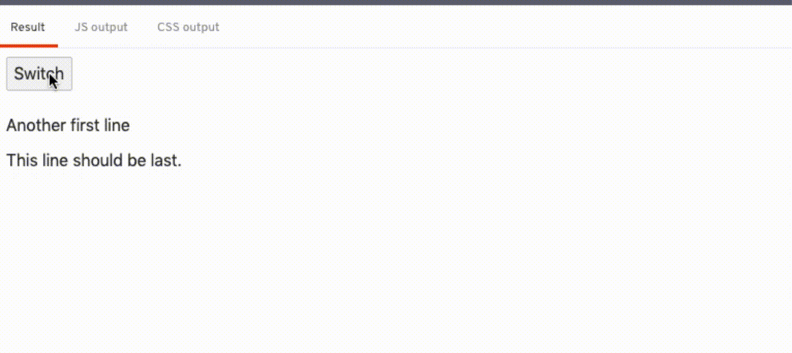

<style>
  .issue {
    border: 4px solid;
    box-shadow: var(--box-shadow);
    margin: 0 calc(-1 * var(--prism-padding));
    padding: var(--prism-padding);
  }
  .issue p {
    margin-bottom: 0.5em;
  }
</style>

## Background

Following [Contributing to Svelte - Fixing issue #4392](/contributing-to-svelte-fixing-issue-4392), I find it interesting to write my thought process down on fixing a Svelte issue.

So today, I'm going to walk through a new issue, [#5012](https://github.com/sveltejs/svelte/issues/5012).

## The bug

<div class="issue">

**Slot containing only {@html '{@html value}'} renders in wrong place on update [#5012](https://github.com/sveltejs/svelte/issues/5012)**

When a slotted component is instantiated and the only contents of the slot is {@html '{@html value}'}, changing value will cause the HTML-ized value to render at the end of the slot's parent element (i.e. after all sibling elements) instead of in the correct place.

**To Reproduce**

https://svelte.dev/repl/1f9da40bca4b44a089041e826648de2f

Click the Switch button and see that the contents of the slot moves to the end.

**Expected behavior**

Slot continues to render in the correct place.

**Information about your Svelte project:**

Looks like this appeared in version 3.7 and is still present in 3.23.2. If I run the REPL on 3.6.11 it behaves properly.

**Severity**

Potentially serious, but not serious for me.

Can be worked around by changing the slot contents to `<div>{@html value}</div>` or changing the child component to use `<div><slot /><div>`, which works fine for me.

</div>

## Verifying the bug

I clicked into the REPL and tried to understand about the bug.

Initially, you see 2 lines of text, "Another first line", "This line should be last.".

But as soon as I updated the `{@html content}`, the `{@html content}` moved to be after the "This line should be last." and stayed there.



Yup. This is indeed a bug! 🐛

## Investigating the bug

It's amazing that the issue author tracked down the regression behavior of this issue, stating that it started happening since 3.7. Probably because the author just upgraded Svelte from {@html '<'} 3.7, or maybe he tried every versions to figure out whether it is regression bug or a undiscovered bug. Anyway, kudos to the issue author! 💪 💪

Most open source projects maintain a change log file, usually named `CHANGELOG.md` located at the root of the project folder, so that you can figured out what's added / removed / updated in each version.

You can find Svelte's [`CHANGELOG.md` here](https://github.com/sveltejs/svelte/blob/master/CHANGELOG.md).


From the changelog, the most relevant commits seemed to be **"Remount HTML tags correctly ([#3329](https://github.com/sveltejs/svelte/pull/3329))"**

Reading through the PR, it seemed that [#3329](https://github.com/sveltejs/svelte/pull/3329) was when `HtmlTag` is first introduced!

### HtmlTag

[`HtmlTag`](https://github.com/sveltejs/svelte/blob/1c39f6079f630ea549984b8e9eda1853cd5fa883/src/runtime/internal/dom.ts#L321-L362) is a helper class that helps Svelte manage raw [`{@html ...}` tag](https://svelte.dev/tutorial/html-tags).

```js
// in the compiled Svelte code,
// you would see the use of `HtmlTag`
// when you use `{@html ...}`
const html_tag = new HtmlTag(anchor);
// mounting raw html string, call the `m`ount method
html_tag.m('<div>content</div>', target, anchor);
// when the html string content change, call the u`p`date method
html_tag.p('<b>new</b>html<br />');
// when unmount, call the `d`etach method
html_tag.d();
```

The HtmlTag instance provides the `m`, `p`, `d` method, and it will maintain the HTML elements created through the HTML string.

So, before v3.7, `{@html ...}` was handled differently, and from the PR, I assume it was more buggy than the current implementation, albeit getting the case reported by this issue #5012 right. So, there's no reverting back, nor taking the implementation pre-v3.7 as a reference to figure this bug out.

Reading through the implementation of the `HtmlTag`, it seemed that the `anchor` is a key to this issue.

`HtmlTag` uses [`insertBefore`](https://developer.mozilla.org/en-US/docs/Web/API/Node/insertBefore) to insert HTML elements into the DOM. There's a nullable 2nd argument for `insertBefore`, if it is `null`, the element will be inserted at the end of the parent.

In this case, the `anchor` is indeed `null`, so when there's a change in the HTML content, the previous HTML elements were removed and the new HTML elements were inserted at the end of the parent.

```html
<!-- Initially -->
<article>
  <!-- slot -->
  {@html content}
  <!-- slot -->
  <p>
    This line should be last.
  </p>
</article>

<!-- when the html content changed -->
<article>
  <!-- slot -->
  <!-- {@html content} removed -->
  <!-- slot -->
  <p>
    This line should be last.
  </p>
  {@html content}
  <!-- inserted at the end of the parent -->
</article>
```

**Why doesn't the `{@html content}` added at the end of the parent in the initial render?** Well, the elements are added in order during mounting. The HTML elements from `HtmlTag` was added at the end of the parent, followed by the `<p>This line should be last</p>`.

The `anchor` is an argument to the `HtmlTag` constructor, so one can safely assume that it is not always `null`.

So, I tried out using `{@html content}` in various ways, to figure out what may be an anchor for the `HtmlTag`

**Repro #1** ([REPL](https://svelte.dev/repl/f31104585d974a54a76808aa5d0820a8?version=3.23.2))

```svelte
<script>
  let content = 'first line';
</script>

{@html content}<button on:click={() => {content = 'line first';}} />
```

```js
// compiled js
// ...
  c() {
    button = element("button");
    html_tag = new HtmlTag(button);
  },
// ...
```

In this case, the `<button />` element turns out to be the anchor, which totally make sense, as the html content should be inserted before `<button />`.

So, it seemed like the anchor is the next element right after `{@html ...}`. 🤔

**Repro #2** ([REPL](https://svelte.dev/repl/d469d63a77c94998839603738ea97451?version=3.23.2))

```svelte
<script>
	import Foo from './Foo.svelte';
  let content = 'first line';
</script>

<button on:click={() => {content = 'line first';}} />
{@html content}<Foo />
```

```js
// compiled js
// ...
  c() {
    button = element("button");
    t = space();
    html_anchor = empty();
    create_component(foo.$$.fragment);
    html_tag = new HtmlTag(html_anchor);
  },
// ...
```

If the next element right after `{@html ...}` is a component, then Svelte will insert a empty [Text](https://developer.mozilla.org/en-US/docs/Web/API/Text) node in between `{@html ...}` and the component, and the anchor is the empty Text node.

Well, that make sense too, because we can't see what's inside the component, we can't get the first element rendered in the component as the anchor. So, an extra empty Text node is used for anchoring.

So, it seemed like the anchor for the `HtmlTag` depends on the next element, and the `HtmlTag` itself is the last element, then the anchor would be `null`.

This seemed fine in most cases, as in if the `HtmlTag` is indeed the last element of its parent, then, we don't need an anchor. Adding and updating `HtmlTag` will always add HTML elements at the end of its parent.

However, I figured there are 2 edge cases that this assumption may not be true.

The 1st edge case is the one reported in the issue #5012, if the `{@html ...}` is the last element within a slot. As we can't tell how the slot would be used in the component, it may not be the last element of it's parent.

```svelte
<div>
  <slot />
  <div>This is the last child</div>
</div>
```

The 2nd edge case is that `{@html ...}` is the last element, but it is a the root of the Component.

```svelte
<!-- Component.svelte -->
<script>
  export let content;
</script>

{@html content}

<!-- App.svelte -->
<script>
  import Component from './Component.svelte';
</script>
<div>
  <Component content={'<div>html string</div>'}/>
  <div>This is the last child</div>
</div>
```

[REPL](https://svelte.dev/repl/9d19540d1eb249c3af519894e42f0f75?version=3.23.2)

As you can see in this contrived example, we can't assume where the component is being used by its parent, so, even it seemed to be the last element in the component, it may not be the case in the parent component.

## Fixing the bug

Once we figured out the cause of the bug, the fix is much simpler.

Just as how Svelte will add a empty Text node as an anchor if the next element is a component, we are going to add the same anchor if

- the `{@html ...}` has no next element, and
- either
  - `{@html ...}` is at the root of a slot, or
  - `{@html ...}` is at the root of a component.

I know my way in the Svelte repo, good enough to know where to add this extra condition.

But if you are new, you can try global search the keyword `html_anchor`, the variable name of the anchor added by Svelte, it should lead you to it.

```js
// src/compiler/compile/render_dom/wrappers/RawMustacheTag.ts#L42

const needs_anchor = in_head || (this.next && !this.next.is_dom_node());

// ...
if (needs_anchor) {
  block.add_element(html_anchor, x`@empty()`, x`@empty()`, parent_node);
}
```

[Link to Github](https://github.com/sveltejs/svelte/blob/1c39f6079f630ea549984b8e9eda1853cd5fa883/src/compiler/compile/render_dom/wrappers/RawMustacheTag.ts#L42)

Here we see that the condition of adding an anchor is that if

- it is in the `<svelte:head>`, or
- the next element is not a dom element, (which could be a component, or logic blocks _(oh why didn't I think about this case too?)_)

```js
const needs_anchor =
  in_head ||
  (this.next
    ? !this.next.is_dom_node()
    : !this.parent || !this.parent.is_dom_node());
```

So, we check if

- it has a parent (if it is at the root of component), or
- if the parent is not an element (it could be within a slot, or a logic block `{#if}`)

For the test case, I used to 2 edge case examples, try to simulate some clicks, and make sure that the `{@html ...}` stay in place even after the HTML content changes.

```js
export default {
  html: `
    <button>Switch</button>
    <p>Another first line</p>
    <p>This line should be last.</p>
  `,
  async test({ assert, target, window }) {
    const btn = target.querySelector('button');
    const clickEvent = new window.MouseEvent('click');

    // simulate clicks
    await btn.dispatchEvent(clickEvent);

    assert.htmlEqual(
      target.innerHTML,
      `
        <button>Switch</button>
        <p>First line</p>
        <p>This line should be last.</p>
      `
    );

    // simulate clicks
    await btn.dispatchEvent(clickEvent);

    assert.htmlEqual(
      target.innerHTML,
      `
        <button>Switch</button>
        <p>Another first line</p>
        <p>This line should be last.</p>
      `
    );
  },
};
```

You can read the [Pull Request #5061](https://github.com/sveltejs/svelte/pull/5061) to see all the test cases written up.

---

If you wish to learn more about Svelte, [follow me on Twitter](https://twitter.com/lihautan).

If you have anything unclear about this article, find me on [Twitter](https://twitter.com/lihautan) too!
