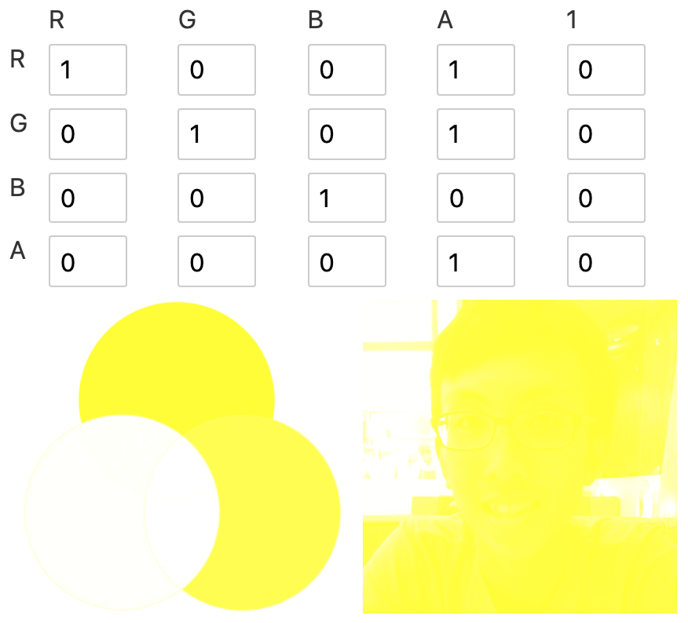
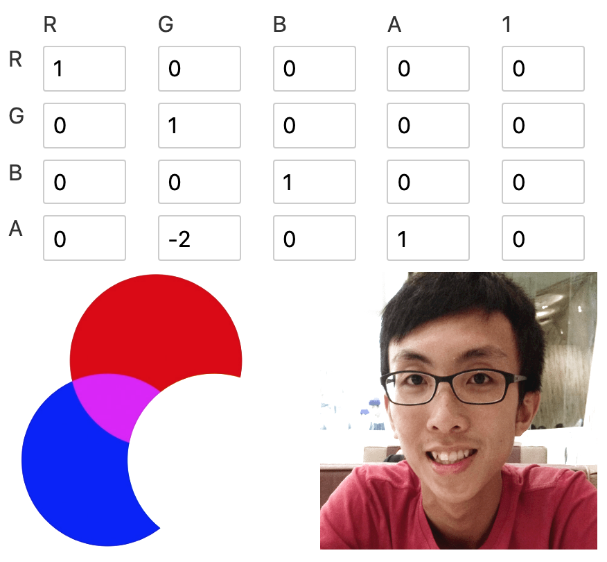
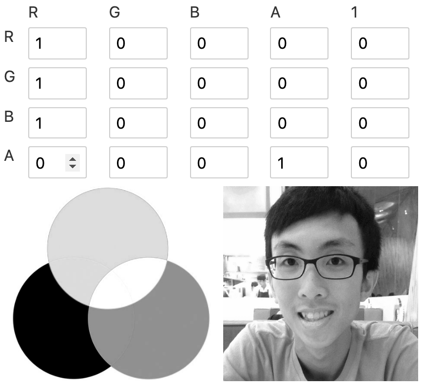

## CSS Filters

- applied in order provided
- you can use filter functions or url to svg filters

```css
.element {
  filter: blur(1px);
  filter: url(#blur);
  filter: url(commonfilters.xml#blur);
}
```

### blur()
- uses gaussian blur
- specify blur radius

```css
.center {
  filter: blur(3px);
}
.right {
  filter: blur(10px);
}
```


### brightness()
- takes in percentage value
- greater than 100% - lightening
- less than 100% - darkening
- 0 - complete black

```css
.left {
  filter: brightness(0.5)
}
.right {
  filter: brightness(1.5)
}
```


### contrast()
- takes in percentage value
- greater than 100% - increasing contrast
- less than 100% - decreasing contrast

```css
.left {
  filter: contrast(0.5)
}
.right {
  filter: contrast(1.5)
}
```


### grayscale()
- grayscale vs desaturation
  - grayscale: perceptual information of the color will be maintained


### invert()
- inverts the dark and light
- `invert(1)` is the default, which completely inverts
- `invert(0.5)` will end up a 50% color gray (light increase and dark decrease at the same amount and meet at 50%)
- can be used to implement dark mode (invert everything, then invert the image again)

### opacity()
- similar to opacity property

### saturate()
- takes in percentage value
- greater than 100% - increasing saturation
- less than 100% - decreasing saturation

### sepia()
- sepia has a warm, yellow/brown appearance
- takes in percentage value
- value from 0% - 100%, 100% is complete sepia, 0% is no effect

### hue-rotate()
- rotates the color along the color wheel
- takes in an angle

### drop-shadow()
- works on the painted space instead of the box
- not casting shadow if it is transparent

### url()
- point to svg filter
- svg must be inline, cannot be a url as an image, so that it can be referenced

```html
<style>
  .element {
    filter: url(#my-filter)
  }
</style>
 
<svg>
  <filter id="my-filter">
     <feGaussianBlur in="SourceGraphic" stdDeviation="5" />
  </filter>
</svg>
```

### `backdrop-filter`
- apply behind the element, instead on the element
- https://css-tricks.com/almanac/properties/b/backdrop-filter/

## SVG Filters

- defined in `<filter>` element
- define a series of one or more filter primitives
- 1 filter primitive performs **1 single fundamental graphic operation** on **one or more** inputs

### filter primitives
- filter primitives named start with `fe`, short for "filter effect"
- filter primitives take 1-2 inputs and output 1 result
- `in` and `in2` attribute for input, `result` attribute for output
- input takes in result, `SourceGraphic` and `SourceAlpha`

```html
<svg>
  <filter id="my-filter">
    <!-- take in 1 input `in` -->
    <feGaussianBlur in="INPUT_NAME" />

    <!-- take in 2 inputs `in` and `in2` -->
    <feComposite in="INPUT_NAME_1" in2="INPUT_NAME_2" />
    
    <!-- `result` defines the result name, 
		which can be passed in as input for the next filter -->
    <feGaussianBlur result="OUTPUT_1" />
    <feGaussianBlur in="OUTPUT_1" />
    
    <!-- use the source as input for the filter primitive -->
    <!-- apply filter on the source element -->
	<feGaussianBlur in="SourceGraphic" />

    <!-- apply filter on the alpha channel of the source element,
		the silhouette of the source -->
	<feGaussianBlur in="SourceAlpha" />
  </filter>
</svg>
```

### filter region
- filter region is based on the bounding box of the element
- filter result beyond filter region will be clipped off
- default filter region extends 10% the width and height of bounding box in all 4 directions

```html
<!-- x, y, width, height sets the filter region -->
<filter
  x="-10%" y="-10%" width="120%" height="120%"
  filterUnits="objectBoundingBox">
  <!-- filter primitives here -->
</filter>
```

- use `<feFlood>` to figure out the filter region
  
```html
<filter>
  <feFlood
    flood-color="#EB0066" flood-opacity="0.5"
    result="flood"></feFlood>
  <feMerge>
    <feMergeNode in="SourceGraphic" />
    <feMergeNode in="flood" />
  </feMerge>
</filter>
```

### Create a drop shadow

1. Blur the silhouette of the layer

```xml
<filter id="my-filter">
  <feGaussianBlur
    in="SourceAlpha" stdDeviation="10" result="DROP" />
</filter>
```


2. Composite the blur layer with a solid color layer to create a colored blur
- Learn compositing + blending in https://www.sarasoueidan.com/blog/compositing-and-blending-in-css/

```xml
<filter id="my-filter">
  <feGaussianBlur in="SourceAlpha" stdDeviation="10" result="DROP"></feGaussianBlur>
  <feFlood flood-color="#EB0066" result="COLOR" />
  <feComposite in="COLOR" in2="DROP" operator="in" result="SHADOW" />
</filter>
```


3. Shift the shadow bottom-right with `<feOffset>`

```xml
<filter id="my-filter">
  <feGaussianBlur in="SourceAlpha" stdDeviation="10" result="DROP"></feGaussianBlur>
  <feFlood flood-color="#EB0066" result="COLOR" />
  <feComposite in="COLOR" in2="DROP" operator="in" result="SHADOW" />
  <feOffset in="SHADOW" dx="10" dy="10" result="DROPSHADOW" />
</filter>
```


4. Combine the shadow with the original image
- layer merge in order of declaration, latter layer stacks on top of previous layer

```xml
<filter id="my-filter">
  <feGaussianBlur in="SourceAlpha" stdDeviation="10" result="DROP"></feGaussianBlur>
  <feFlood flood-color="#EB0066" result="COLOR" />
  <feComposite in="COLOR" in2="DROP" operator="in" result="SHADOW" />
  <feOffset in="SHADOW" dx="10" dy="10" result="DROPSHADOW" />
  <feMerge>
    <feMergeNode in="DROPSHADOW" />
    <feMergeNode in="SourceGraphic" />
  </feMerge>
</filter>
```


### Color Matrix

- https://alistapart.com/article/finessing-fecolormatrix/
- https://css-tricks.com/color-filters-can-turn-your-gray-skies-blue/

```xml
<filter id="linear">
  <feColorMatrix
    type="matrix"
    values="R 0 0 0 0
            0 G 0 0 0
            0 0 B 0 0
            0 0 0 A 0 "/>
</filter>
```

```js
/* R G B A 1 */
1 0 0 0 0 // R = 1*R + 0*G + 0*B + 0*A + 0
0 1 0 0 0 // G = 0*R + 1*G + 0*B + 0*A + 0
0 0 1 0 0 // B = 0*R + 0*G + 1*B + 0*A + 0
0 0 0 1 0 // A = 0*R + 0*G + 0*B + 1*A + 0
```

- [color matrix playground](https://svelte.dev/repl/1fa3e758ef2442d1bcc1eba37a2bdd58)

1. Colorizing


- Removing other color to colorise image into the remaining color
- colorise red -> remove blue & green

- colorise yellow -> remove blue (red + green = yellow)


2. Alpha values

- add opacity level to the red channel
  - any red remaining red
  - green -> yellow (red + green = yellow)
  - blue -> magenta (red + blue = magenta)

- hard yellow filter


- have a value some where between 0-1 to see the mixture in the shadow


- negative value could offset the channel by the amount of opacity

  - the following 2 color matrix is identical
```xml
<filter>
  <feColorMatrix
    type="matrix"
    values="1  0  0  0  0
            0  1  0  0  0
            0  0  1 -1  0
            0  0  0  1  0 "/>
</filter>

<filter>
  <feColorMatrix
    type="matrix"
    values="1  0  0  0  0
            0  1  0  0  0
            0  0  0  0  0
            0  0  0  1  0 "/>
</filter>
```

3. Blowing out channels
- turn 1 color to white
- set the alpha channel to `-2`


4. Change color
- No more green, any green looks like magenta now. (luminosity of green is lost)


5. Lighten or darken
- increase intensity to lighten, decrease to darken


6. Grayscale
- make sure red, green, blue have the same value



- feMerge

svg filter effects
fe color matrix
- 4x4 matrix
[1000,0100,0010,0001]
- a


svg filter

feBlend
- just like how blend mode works
feComponentTransfer 

feComposite
pixel level image interactions, how each pixels composite together

feConvolve
how pixels interacte with its neighbour, this results in blurring, sharpening

feDiffuseLighting
defines a light source

feDisplacementMap
displaces an image, in, using another image in2 to displace the in image

feFlood
fills the filter subregion with the specified color and opacity

feGaussianBlur
same as what `blur()` use

feImage
to use with other filters, feBlend or feComposite

feMerge
asynchronous operations in the filter effects instead of layering them

feMorphology
erods or dilates the input image

feOffset
useful for creating dropShadow

feSpecularLighting
use alpha channel as bump map

feTile
how image repeated to fill the space

feTurbulence
creates image using Perlin turbulence function

https://www.w3.org/TR/filter-effects-1/#ShorthandEquivalents

<style>
  img {
    width: 300px;
  }
</style>

- https://tympanus.net/codrops/2019/01/15/svg-filters-101
- https://www.sarasoueidan.com/blog/compositing-and-blending-in-css/
- https://alistapart.com/article/finessing-fecolormatrix/
- https://css-tricks.com/color-filters-can-turn-your-gray-skies-blue/
- https://css-tricks.com/look-svg-light-source-filters/