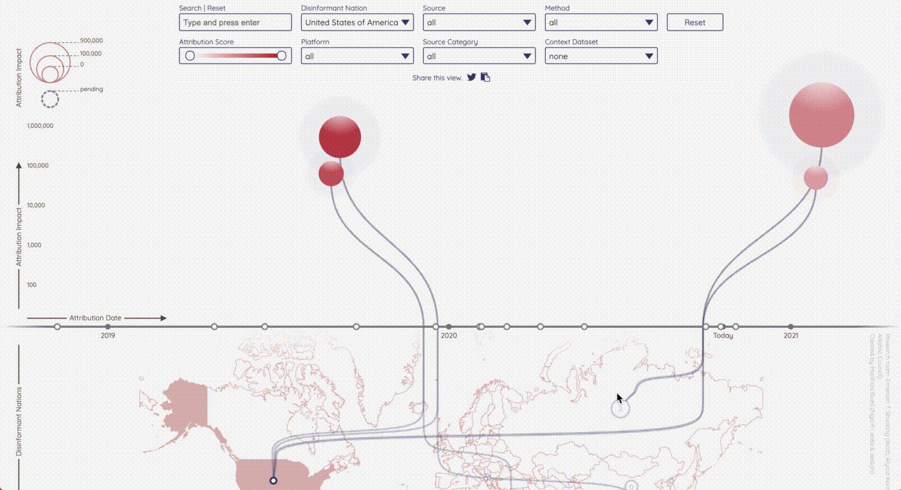
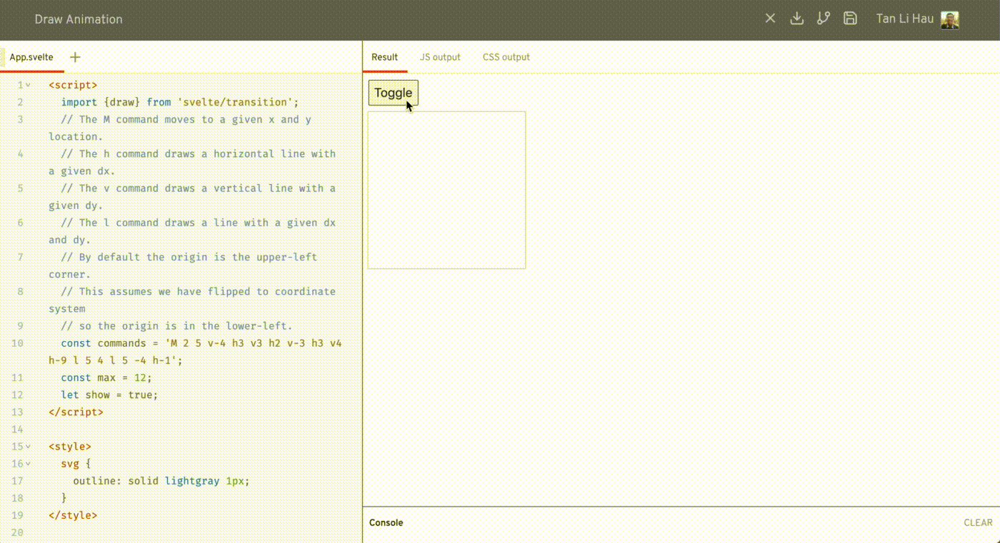
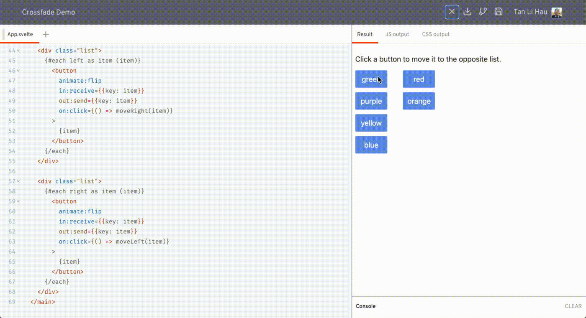

## 1️⃣ The Zen of Svelte

[@mrgnw](http://twitter.com/mrgnw) did a ton of research comparing Svelte with Python, which is apparent on the references used in his talk.

I believe the talk is inspired by 
[@feltcoop](https://twitter.com/feltcoop)'s ["Why Svelte"](https://github.com/feltcoop/why-svelte), where it says

> "Svelte is easy to learn. Its design philosophy shares much with [The Zen of Python](https://www.python.org/dev/peps/pep-0020/)"

> "programming languages are how programmers express and communicate ideas — and the audience for those ideas is other programmers, not computers."
- Guido van Rossum, King's Day Speech 2016 (http://neopythonic.blogspot.com/2016/04/kings-day-speech.html)

> "Frameworks are not tools for organising your code, they are tools for organising your mind"
- Rich Harris, You Gotta Love Frontend Code Camp 2019 https://www.youtube.com/watch?v=AdNJ3fydeao

> People who's day job has nothing to do with software development but who need to use software to process their data, can use Python to make their data processing doing exactly what they want to happen
- Guido van Rossum, Oxford Union 2019 https://www.youtube.com/watch?v=7kn7NtlV6g0

> Because the best thing about jQuery was its inclusivitiy, jQuery said to people like me, with no discrenible programming skill, you too can be part of this thing (bringing creativity to the web)

- Rich Harris, JSCamp 2019, "The Return of 'Write Less, Do More'" https://www.youtube.com/watch?v=BzX4aTRPzno

It works with what you already know, rather than replaces it with something new
- if you can write HTML, you can write Svelte
- with preprocessor, you can write Svelte component with Jade, or Markdown

**Resources to learn Svelte**
- 📺 Svelte Master Youtube channel https://www.youtube.com/channel/UCg6SQd5jnWo5Y70rZD9SQFA
- 🎮 Svelte Interactive Tutorial http://svelte.dev/tutorial
- 🛠 Starter Template - https://github.com/sveltejs/template, https://github.com/sveltejs/sapper-template
- 🎪 MadeWithSvelte - https://madewithsvelte.com/

> Svelte is Zen, because it's for people who wanna make things

## 2️⃣ Prototyping Design with Real Data Models

[@d3sandoval](https://twitter.com/d3sandoval) performed a live coding in the talk. He showed us how he used Svelte to quickly implement an interactive prototype based on a Figma design for user testing.

If you find him familiar, that's because he's the one who wrote the ["What's new in Svelte October 2020"](https://svelte.dev/blog/whats-new-in-svelte-october-2020)

Benefits of building interactive mockup with Svelte
- Fast to get started and going
- Allow user to explore different variations, rather than sticking to the golden path in the user interview
- Faster iteration, faster to test assumptions

Things people asked in the chat:
- Official Svelte VSCode Plugin [svelte-vscode](https://marketplace.visualstudio.com/items?itemName=svelte.svelte-vscode)
- the code https://github.com/d3sandoval/svelte-summit-example

> "Using a production-like data model in application that is quick to build, which may otherwise take longer in our design file, allow us to respond to feedback quickly in prototyping"

## 3️⃣ How does Svelte's crossfade function work?

[@nicolodavis](https://twitter.com/nicolodavis)

- 1️⃣ what it is
- 2️⃣ how it works
- 3️⃣ real world example


If you describe how to move content imperatively
- Copy the HTML from the source container
- Paste it into the target container
- Remove it from the source container


If you want to describe it declaratively in Svelte,
- use `{#if position === 'a'}`
- change `position`

Svelte transition allows you to specify how an element is transition in when it's created, and transition out when it is destroyed.

```svelte
<script>
  import { slide } from 'svelte/transition';
</script>

<div in:slide />
<div out:slide />
```

- 📝 crossfade coordinates the transition from 1 location to another
- 📝 element is destroyed in its old position and created in its new position
- 📝 both transitions are played simulatenously over each other
- 📝 fades out the 1st transition, fades in the 2nd transition


- 📝 call crossfade to get `send` and `release`
- 📝 using `out:send` and `in:receive`
- 📝 the key needs to be the same

```svelte
<script>
  import { crossfade } from 'svelte/transition';
  const [send, receive] = crossfade({
    fallback: null,
  });
</script>

<div id="a">
  {#if position === 'a'}
    <div out:send={{key:"box"}}>
      ...
    </div>
  {/if}
</div>
<div id="b">
  {#if position === 'b'}
    <div in:receive={{key:"box"}}>
      ...
    </div>
  {/if}
</div>
```

See how @nicolodavis uses crossfade in a real-world application, [@boardgamelabapp](https://twitter.com/boardgamelabapp) https://boardgamelab.app/.


## 4️⃣ Zero config Svelte websites with Plenti

[@jimafisk](https://twitter.com/jimafisk) shared a static site generator, [Plenti](https://plenti.co).

**Plenti**
- 🎪 Static Site Generator
- 🏎 Go backend
- 🛠 Build code in Go, no webpack / rollup, inspired by snowpack, called gopack
- ⚡️ Reach to v8 engine directly to compile svelte components
- ✨ Does not depend on Node.js / npm
- 📖 JSON as data source
- 👓 Optimised for screen reader users
- 🍺 Hydrates app into single page application + client-side routing + automatically connects to JSON data source

**Install plenti**

- ⬇️ Download the binary
- 📦 Install using package manager

```sh
# mac (homebrew)
brew tap plentico/homebrew-plenti
brew install plenti

# linux (snap)
snap install plenti

# windows (scoop)
scoop bucket add plenti https://github.com/plentico/scoop-plenti
```

**Plenti command**

```sh
# create a new site
plenti new site svelte-summit
# create a new type
plenti new type events

# starts a lightweight webserver for local development
plenti serve
```

> "You be so productive that you forget to check Twitter" 

## 5️⃣ How you setup data visualization with Svelte

[@h_i_g_s_c_h](http://twitter.com/h_i_g_s_c_h) showed us how to use svelte to defend democracy. 🏹🛡🐉

Check out his talk if you want to learn
- ✨ how to produce great nice visualisation with svelte
- 🎨 how to use all the nice features that svelte comes with to produce cool visualisation

3 things to love svelte + data visualisation

**1️⃣ modularisation**

- organise code in components


**2️⃣ transitions**

- ✨ easy to use
- 🎭 built-in transitions, such as `fade`, `draw`

```svelte
<!-- src/components/Balloon.svelte -->
<g class="balloon"
   in:fade|local={{duration: bloomDuration, delay: growDuration + timePoint.id * jitterFactor}}
   out:fade|local={{duration: bloomDuration, delay: timePoint.id * jitterFactor}}>
  <circle ... />
</g>
<!-- src/components/SourceLink.svelte -->
{#if (source.show)}
  <g class="source-link">
    <path d={...}
      stroke-width={$minDim / 200}
      in:draw|local={{duration: growDuration, delay: source.id * jitterFactor, easing: linear}}
      out:draw|local={{duration: growDuration, delay: bloomDuration + source.id * jitterFactor, easing: linear}}></path>
  </g>
{/if}
```



**3️⃣ actions**

- allow reusable logics
- can reuse across projects

```svelte
<!-- src/components/Slider.svelte -->
<div class="slider-handle"
  use:slidable
  on:slide={(e) => handleSlide(e, 'right')}
  on:slideend={(e) => handleSlideEnd(e, 'right')}>
  ...
</div>
```

Resources
- 🔗 https://github.com/DFRLab/interference2020
- 🔗 https://interference2020.org
- 🔗 https://twitter.com/h_i_g_s_c_h
- 🔗 https://www.higsch.com/

[Is that "Svelte" in German accent?](https://twitter.com/h_i_g_s_c_h/status/1317963855201554433?s=20)

## 6️⃣ Svelte at the Edge: Powering Svelte Apps with Cloudflare Workers

[@lukeed05](https://twitter.com/lukeed05) shared with us how to deploying server-side rendering + Svelte + Cloudflare Workers at global scale 🌎

Types of workers
- Web Workers 
  - most common, general purpose, execute tasks off main thread
- Worklets
  - very lightweight, access to low-level render processes
- Service Workers
  - proxy between client and network / cache
  - may intercept HTTP requests entirely
- Cloudflare Workers
  - works similarly as Service Workers, as a proxy between client and network / cache
  - difference is its physical location

Workers KV
- key value store
- available in every network location
- extra persistent layer the worker can write into and read from anywhere

Worker Sites
- upload the built assets into Workers KV
  - filepath as key, file content as value
- handle request by 
  - serve from cache
  - cache miss, respond with content in Workers KV

To build a svelte app for Cloudflare, make sure
- `hydrate: true`, so it hydrates on the browser
- no assumptions on being within the browser context
- build the site twice
  - 1 for the DOM output, 1 for SSR output
  - `generate: 'dom' | 'ssr'`

[Demo code](https://github.com/lukeed/svelte-ssr-worker)

Tools
- https://developers.cloudflare.com/workers/cli-wrangler
- https://github.com/lukeed/cfw
- https://github.com/lukeed/freshie

[cfw](https://github.com/lukeed/cfw) 
Suite of utilities for building and deploying Cloudflare Workers

[freshie](https://github.com/lukeed/freshie)

CLI to build universal applications, supporting different backends (Node.js, Cloudflare Workers) X different frontends (Svelte, Vue, Preact)

## 7️⃣ Svelte à la Mode

A fun, cheeky talk by [@ronvoluted](https://twitter.com/ronvoluted), where he draws comparison of web + svelte to Pie à la Mode

The pie 🥧, represent the web, the juicy things you can do with the web, it's a wondrous platform and it's prevalent. 🤤

Svelte helps us embracing these qualities by sweetening the deal. That's the ice cream on top. 🍨

@ronvoluted reminded us how easy to create a @sveltejs app

- 1️⃣ copy HTML markup from source elements panel of a website you like
- 2️⃣ paste it in svelte.dev/repl
- 3️⃣ copy + paste in the styles from the styles panel
- 4️⃣ add `<script>` tag to sprinkle some logic

Resources to check what's available in the web platform

- 🔗 https://developer.mozilla.org/en-US/docs/Web/API
- 🔗 http://developers.google.com/web/updates
- 🔗 https://whatwebcando.today/

Check out these cool cats who made the web interactions that were showcased:

- A Century of Surface Temperature Anomalies by Aodhan Sweeney http://students.washington.edu/aodhan/webgl_globe.html
- Dr Who Dalek ring modulator by @BBCRD https://webaudio.prototyping.bbc.co.uk
- Creepy Mouth SVG by @shepazu http://svg-whiz.com/svg/linguistics/theCreepyMouth.svg

Behind the scenes of his floating head in the talk Rolling on the floor laughing

https://twitter.com/SvelteSociety/status/1318196128769134592?s=20

## 8️⃣ Introduction to Svite

Dominik G introduce us to Svite, a Svelte integration for vite.

He walked us through the 3 basic commands of svite

```bash
# create a new svite project from template
svite create hello-submit

# start the dev server
svite dev

# build for production
svite build
```

Svite supports hot-module reloading, and this is how fast it is


🛣 Roadmap
- prerender HTML after build
- improved typescript support
- template for library development
- website and more documentation
- or your next great idea

🔗 https://github.com/dominikg/svite

## 9️⃣ Svelte Animations

[@mark_volkmann](https://twitter.com/mark_volkmann) talked about transitions in svelte

2 kinds of animations
- 1️⃣ when an element is added or removed 
  - eg: fade in when added, slide out when removed
- 2️⃣ when a value changes
  - eg: gradually change from current value to new value

Easing functions
- animations can proceed at varying rates over duration
- Ease visualiser https://svelte.dev/examples#easing
- easing names end with `In`, `Out`, `InOut`
  - `In` affects the beginning of a transition
  - `Out` affects the beginning of a transition
  - `InOut` affects the beginning and ending of a transition


animate:flip
- moves element in an `{#each}` block to the target location when it changes
- like other transitions, accept custom `delay`, `duration`, `easing`


https://svelte.dev/repl/b4cceba5e8a14e379e1b07f47b792eef?version=3.26.0

`svelte/motion`
- `spring` and `tweened` allow you to create writable stores whose values animate from old to new values

```svelte
<script>
  import { spring, tweened } from 'svelte/motion';
  let percent = 0;
  const tweenedStore = tweened(0, {duration: 1000});
  const springStore = spring(0, {stiffness: 0.3, damping: 0.3});

  $: tweenedValue.set(percent);
  $: springValue.set(percent);
</script>

<input type="number" min={0} max={100} bind:value={percent} />
{$tweenedStore} {$springStore}
```


https://svelte.dev/repl/2625cd905ee24bc0ba462ea6ab61284f?version=3.26.0

- custom interpolation function

```svelte
<script>
	import {tweened} from 'svelte/motion';

	function rgbInterpolate(fromColor, toColor) {
    // ...
		return t => {
      // ...
			return calculateColr(fromColor, toColor, t);
		};
	}
	
	const color = tweened('#ff0000', {duration: 1000, interpolate: rgbInterpolate});
</script>

<h1 style="color: #{$color}">Tweened Color: {$color}</h1>
```

https://svelte.dev/repl/073c71dbdd9c4250b2ad5c9343e2e053?version=3.26.0

transitions
- `blur`, `draw`, `fade`, `fly`, `scale`, `slide`, `crossfade`
- using directives, `in:`, `out:`, `transition:`
- apply to HTML element


`transition:draw`
- for SVG `path` element



https://svelte.dev/repl/149a5c35040343daa9477e0d54412398?version=3.26.0

`crossfade` transition
- creates `send` and `receive` transitions, used to coordinate movement of an element from one parent to another


https://svelte.dev/repl/5fc4b5dd5dec49d2be3fa160693372ce?version=3.26.0

Custom transitions
- a function that follows a few basic rules
- take 2 arguments, the DOM node and the options
- return an object whose properties include
  - transition options
  - css method, which passed a time value between 0 and 1, and must return a string containing CSS properties to be applied to the DOM node for the time value
- https://svelte.dev/repl/082e308f9fe44bcb98621dab346c2e85?version=3.26.0

```js
<script>
	import {backInOut, linear} from 'svelte/easing';

	function spin(node, options) {
		const {easing, times = 1} = options;
		return {
			// The value of t passed to the css method
			// varies between zero and one during an "in" transition
			// and between one and zero during an "out" transition.
			css(t) {
				const degrees = 360 * times; // through which to spin
				return `transform: scale(${t}) rotate(${t * degrees}deg);`;
			}
		};
	}
</script>

<div class="center" transition:spin={options}>
  <div class="content">Take me for a spin!</div>
</div>
```

Transition events
- `introstart` when an "in" transition begins
- `introend` when an "in" transition ends
- `outrostart` when an "out" transition begins
- `outroend` when an "out" transition ends

Resources
- Slides https://github.com/mvolkmann/talks/blob/master/svelte-animations.key.pdf
- Mark Volkmann's book, Svelte and Sapper in Action https://www.manning.com/books/svelte-and-sapper-in-action
