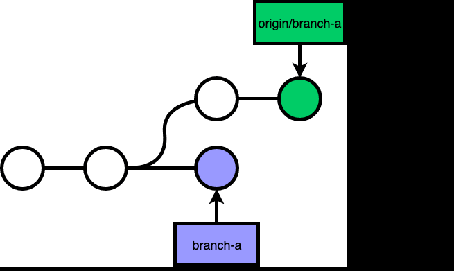
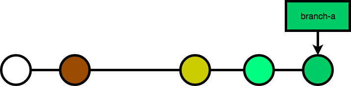

<style>
  .caption {
    margin-top: calc(-1 * var(--margin) + 16px);
    margin-bottom: var(--margin);
    text-align: center;
    font-style: italic; 
  }
</style>

This week in React Knowledgeable, I did a sharing on Git commands.

The title of the talk was called **"Git Gudder"**, because almost a year ago I did a lightning sharing on "Git Gud", _(Get Good)_, this follow up sharing used the comparative of "Git Gud", therefore, "Git Gudder".

> Will there be a "Git Guddest"? 🤔

## Disclaimer

I am by no means a Git master or anywhere near mastering Git. I do google or [refer to the docs](https://git-scm.com) whenever I am unsure of the commands. In this talk, I listed out all the common history manipulation commands Git provides. I hoped that, with it, we are aware of what is available in our toolbox. So, we can look for it whenever we need it.

## git merge

There's 2 kind of `git merge`, the **fast-forward** and **non fast-forward**.

### Fast-forward merge

Merging `master` into `branch A`:


<div class="caption">Fast-forward merge</div>

### Non Fast-forward merge

Merging `master` into `branch A`:


<div class="caption">Non fast-forward merge</div>

Non fast-forward merge will create an extra commit that merges 2 branches.

### git pull

By default, `git pull` is `git fetch origin branch` + `git merge origin/branch`.



<div class="caption">git pull</div>

## git reset

`git reset --hard` allows you to change the reference of where your branch is pointing at.

`git checkout branch-b`, `git reset --hard branch-a`, `git reset --hard #d`:


<div class="caption">git reset</div>

## git cherry-pick

cherry-pick allows you to pick commits from some other branches, tags, or refs.

`git checkout branch-b`, `git cherry-pick branch-a`:


<div class="caption">git cherry-pick</div>

## git revert

`git revert` creates a new commit that reverses the change of the commit that you are reverting.

For example, if you accidentally merged `feat/a` into `master` branch, you can `git checkout master`, `git revert #1`:


<div class="caption">git revert</div>

If you know merge master into your `feat/a` branch, you would noticed that all the changes in the branch is gone, because the merge is a fast-forward merge, that includes the revert commit made in the branch:


<div class="caption">Merging `master` into `feat/a`</div>

If you want to recover the changes made in `feat/a`, you can `revert` the `revert`:

`git revert ~#1`:


<div class="caption">git revert the revert</div>

Now, when you are ready to merge your `feat/a` branch into `master`, you get the all the changes in `feat/a`, a commit that revert all that, and a commit that reverts the revert commit, which meant, you still have all the changes in `feat/a` in `master`:


<div class="caption">Merging changes back to master</div>

## git rebase

`git rebase` allows you to "move" commits to a different "base".

For example, you branched out `branch-a` from `master` a while ago, and `master` has made a few more commits. But if you merge your branch into master now, it would be a non fast-forward merge, creating an extra commit to the history. If you want a clean, one-line history, you can do a `rebase`, replaying commits that you have made in `branch-a` on top of the latest `master`.

`git checkout branch-a`, `git rebase master`:


<div class="caption">git rebase</div>

`git rebase` does not have to be on top of the branch that you branched out, you can rebase to anywhere:

`git checkout branch-a`, `git rebase --onto branch-b master branch-a`:


<div class="caption">git rebase</div>

There's 3 reference point you should know when doing a git rebase:

- `<new base>`
- `<upstream>`
- `<branch>`


<div class="caption">git rebase</div>

Here are a few things you should know:

- `git rebase` will replay the commits from `<upstream>` to `<branch>` onto `<new base>`.
- If you specify `<upstream>` as a branch name, `git rebase` will replay commits from the common ancestor of `<upstream>` and `<branch>` to `<branch>`.
- If you do not specify `<branch>`, the default is the `HEAD`, current commit you are at now.
- If you do not specify `--onto <new base>`, the new base will be default to `<upsttream>`, that's why `git rebase master` is equivalent to `git rebase --onto master master`.
- If you do not specify `<upstream>`, it will be the upstream of the current branch. So `git rebase` is equivalent to `git rebase <origin/current-branch>`.

### git rebase --interactive

`git rebase` has an interactive mode, which allows you to specify instructions while replaying commits during a rebase.


<div class="caption">git rebase interactive</div>

When you run `git rebase --interactive`, git will prompt you with an editor to edit the instructions. In it, you will see a list of commits that will be replayed:

```
pick #2 commit msg 2
pick #3 commit msg 3
pick #4 commit msg 4
pick #5 commit msg 5
pick #6 commit msg 6

# Rebase #1..#6 onto #1 (5 commands)
#
# Commands:
# p, pick = use commit
# r, reword = use commit, but edit the commit message
# e, edit = use commit, but stop for amending
...
```

#### pick

The default instruction. Will just use the commit while replaying:


```
pick #2 commit msg 2
pick #3 commit msg 3
pick #4 commit msg 4
pick #5 commit msg 5
pick #6 commit msg 6
```

#### drop

Drop will omit the commit:



```
pick #2 commit msg 2
drop #3 commit msg 3
pick #4 commit msg 4
pick #5 commit msg 5
pick #6 commit msg 6
```

#### squash & fixup

Squash & Fixup will combine your commit with the previous commit, the only difference is that with `squash`, git will prompt you to edit the commit message of the combined commit, while `fixup` will drop the commit of the `fixup`ed commit.


```
pick   #2 commit msg 2
squash #3 commit msg 3
pick   #4 commit msg 4
fixup  #5 commit msg 5
pick   #6 commit msg 6
```

#### break

Pause the rebase. You can do add more commits here if you want. When you are done, make sure that your workspace and stage is clean, run `git rebase --continue` to continue.


```
pick   #2 commit msg 2
pick   #3 commit msg 3
break
pick   #4 commit msg 4
pick   #5 commit msg 5
pick   #6 commit msg 6
```

#### edit

Pause the rebase at the commit that you are editing, before the commit has been commited. You can add, remove or ammend your files before continue the rebase process.


```
pick   #2 commit msg 2
edit   #3 commit msg 3
pick   #4 commit msg 4
pick   #5 commit msg 5
pick   #6 commit msg 6
```

### git pull --rebase

There's a rebase mode for git pull, where it will be `git fetch origin branch` + `git rebase origin/branch`.


<div class="caption">git pull --rebase</div>

### git rebase a shared branch

Say `x` and `y` are working on the `feat/a` branch.


`x` decided to rebase the `feat/a` branch to squash and drop some commits:


While `x` had done that, that was just a part of the whole picture. Because the `rebase` on his local machine changed the git history on his local copy only.


To make the change on the remote server as well, `x` forced push his branch to the remote server. (**Note:** You can push without `--force` if the origin branch cannot fast-forward merge your local branch)

While `y` on the other hand, did not know about the `rebase`, so when `y` pulled the code, it ended up with a messed up merged of a messed up git history:


In most cases, there would be a merge conflict, because `x` and `y`'s branch would have made changes on the same file.

So, the correct way, if the rebase is necessary, is to notify `y` about the rebase, so that `y` can `git reset --hard` his branch to the remote branch.


If unfortunately, at the same time, `y` has made more commits to his local branch, he would have to `git rebase` the new changes onto the remote branch, or `git cherry-pick` the new changes after the `git reset --hard`.

In the companies that I have worked with, forbidden a `rebase` on a common branch, especially the `master` branch.

## git log

The go-to command to look at your git history. There's a few options that is worth mentioning, that allow us to search through the sea of commits:

### --since, --after, --until, --before

You can filter out commits within a specific timeframe

### --grep

You can filter out commits based on commit message

### --invert-grep

You can filter out commits that does not match the `--grep`

### --all-match

`--grep` is a `OR` filter, `--all-match` make it a `AND` filter

### --min-parents, --max-parents, --merges, --no-merges

You can specify commits with the number of parents. A simple merge commit has 2 parent, so `--merge` is equivalent to `--min-parents=2`.

### --first-parent

You can follow only the first parent commit upon seeing a merge commit. This is especially useful when you have merged of branches in, `--first-parent` allow you to filter out only the merge commit and the commit you have made on the current branch.

## git reflog

The reference log shows you all the `HEAD` position you have been to. This is especially useful when you have `reset --hard` or `rebase`, you can still find back the commit reference that you were at previously, so you can recover them.

## git bisect

This is a useful command that I am looking forward to use it.

Often times when you noticed something has changed / break / less optimised, yet you do not know when this change was introduced into your repository. `git bisect` allows you to do binary search on the history, so that you can quickly pin down the commit where the change was introduced.

```sh
$ git bisect start # starts the bisect session
$ git bisect bad v2.5.1 # specify the commit you know is bad
$ git bisect good v2.6.13 # specify the commit you knew were good
```

Once you've specified at least one `bad` and one `good` commit, `git bisect` will find and checkout to a commit in the middle of that range between `bad` and `good` and greets you with:

```
Bisecting: 675 revisions left to test after this (roughly 10 steps)
```

You can know test / verify / profile your code, and specify whether the current commit is a `good` commit or a `bad` commit:

```sh
# if it is a good commit
$ git bisect good

# if it is a bad commit
$ git bisect bad
```

Continue doing it until eventually there's no more commit to inspect. `git bisect` will print out the description of the first bad commit.

## Summary

We've gone through the following git commands:

- git merge
- git reset
- git cherry-pick
- git revert
- git rebase
- git log
- git reflog
- git bisect

Hopefully we are now `git gudder` than before!

---

Related topic: [Git commits went missing after a rebase](/commit-went-missing-after-rebase/)
