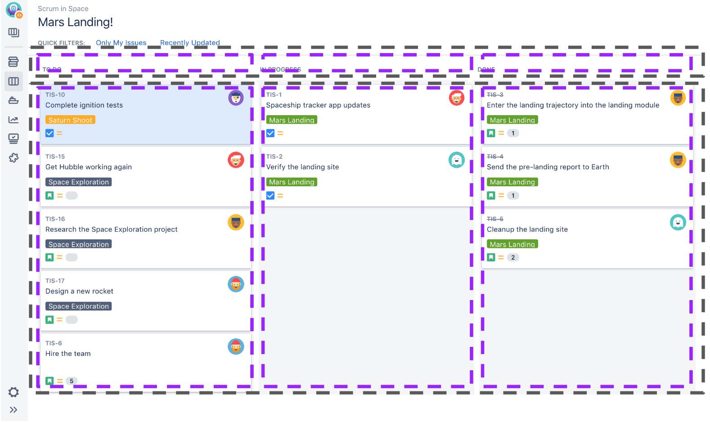

It's Friday evening, so I've decided to go light and easy, and share with y'all 2 interesting anecdote while I was working on Svelte.

## First Story

The first story started with [Hacktoberfest](https://hacktoberfest.digitalocean.com/).


Anyone knows about Hacktoberfest? Anyone finished Hacktoberfest?

So for to benefit of those who don't know about Hacktoberfest, Hacktoberfest is an annual event organised by [DigitalOcean](https://www.digitalocean.com/), and this year they partnered with [dev.to](http://dev.to/).

So during the month of October, if you managed to make 4 PRs to any public [Github](http://github.com/) repository, you will get a free T-shirts and swags.


So this year Hacktoberfest, I was working on this frontend framework called [Svelte](https://svelte.dev/).

If you never heard about Svelte, I recommend you to watch Rich Harris talk on ["Rethinking Reactivity"](https://www.youtube.com/watch?v=AdNJ3fydeao).

So what so special about this new frontend framework?

Well, firstly, a svelte component is a single file component, just like Vue. You have your script, styles and HTML elements all in one place:

```html
<style>
  div { color: blue; }
</style>

<script>
 let greeting = 'Hello world!';
</script>

<div>{greeting}</div>
```

Secondly, Svelte is a compiler. It compiles the single file component into simple JavaScript statements like these:

```js
let greeting = 'Hello world!';
const div = document.createElement('div');
const text = document.createTextNode(greeting);

target.appendChild(div);
div.appendChild(text);
```

It is the simplest way of creating DOM nodes, not much overhead code, no work loop like React, nothing.

The benefit of doing this is that the bundle size can be very small, and it can run without much runtime overheads.

However, if you look at a slightly more complex component like the one below:

```html
<script>
 let greeting = 'Hello world!';
</script>

<div>
 <div>Header</div>
 <div>
   <div>Lorem ipsum</div>
   <div>{greeting}</div>
 </div>
</div>
```

it gets compiled into more code:

```js
let greeting = 'Hello world';

const div1 = document.createElement('div');
const div2 = document.createElement('div');
div2.textContent = 'Header';
const div3 = document.createElement('div');
const div4 = document.createElement('div');
div4.textContent = 'Lorem ipsum'
const div5 = document.createElement('div');
const text = document.createTextNode(greeting);

target.appendChild(div1);
div1.appendChild(div2);
div3.appendChild(div4);
div4.appendChild(div5);
div1.appendChild(div3);
```

Which is natural right?

But, when I was fiddling the [Svelte REPL](http://svelte.dev/repl), I was looking at the code, thinking to myself, in this component, greeting has never changed, so there's no need for any reactivity, so why should we still build element one by one, why not just use `innerHTML`?

```js
let greeting = 'Hello world';

target.innerHTML = `
 <div>
   <div>Header</div>
   <div>
     <div>Lorem ipsum</div>
     <div>${greeting}</div>
   </div>
 </div>`
```

So, that was what I did, and I [submitted an PR](https://github.com/sveltejs/svelte/pull/3808).

I was ecstatic when it got merged, and [Rich commented "Damn, this is nice!"](https://github.com/sveltejs/svelte/pull/3808#issuecomment-546704569).

But little did I know a few days later, someone commented on the PR [about opening up to XSS risk](https://github.com/sveltejs/svelte/pull/3808#issuecomment-546723297).

XSS (Cross-Site Scripting)? What?!

So imagine instead of a friendly greeting, someone with a malicious intent changed it to something else:

```js
let greeting = '<div onclick="alert(&quot;oh no&quot;);">click me</div>';

target.innerHTML = `
 <div>
   <div>Header</div>
   <div>
     <div>Lorem ipsum</div>
     <div>${greeting}</div>
   </div>
 </div>`
```

Then you would have a malicious click me button on the screen! 😱

So I googled, and I found this [Open Web Application Security Project (OWASP)](https://github.com/OWASP/CheatSheetSeries), which they have a long list of [cheatsheets about and how to prevent web vulnerability](https://github.com/OWASP/CheatSheetSeries/tree/master/cheatsheets).


I read up on them and got to learn more about methods to prevent XSS, and so I [made another PR](https://github.com/sveltejs/svelte/pull/3816).

And it got fixed! Finally!

Or is it? 🤔

Well in my new PR, I did not revert all the changes I made previously, I still attempt to have some optimisation with static content. So instead of using `innerHTML`, I used `textContent`, which is safe for XSS attacks.

```js
// instead of this,
$0.innerHTML = '&amp;&gt;'
// it is now this:
$0.textContent = '&amp;&gt;'
```

So, although they looked similar, but when it got executed, they are different:

```html
<!-- with innerHTML -->
<div>&></div>
<!-- with textContent -->
<div>&amp;&gt;</div>
```

`textContent` will not unescape the string content.

Someone found it and raised an issue, so I [made another PR](https://github.com/sveltejs/svelte/pull/3916).

So, that's my first story, of how I innocently trying to optimise the bundle, ending up creating a XSS risk, and how I made multiple PRs to fixed them.

Before I moved on to the 2nd story, I have a few takeaways I would like to share:

- As a React developer, I have been so used to have React taking care of the XSS vulnerability for me. As long as i dont use `dangeourslySetInnerHtml`, I'm all good. Therefore, it has never occur to me that it is still a potential threat.

- I find it interesting to work on technologies/stack that we don't use it at work during free time. Having to work on 1 tech stack full time during the day, I felt like I've been trapped inside my own bubble, with no idea what is happening outside. So while working on Svelte, I learned a lot of things that I could never got it from work.

## Second Story

The second story, is about connecting the dots.

In Svelte, CSS is scoped in the component that you are writing. In this example:

```html
<style>
  div {
    padding: 5px;
  }
</style>

<div>
  <Component />
</div>
```

the `padding: 5px` will only apply to the all the `<div>`s written in this component file. Any `<div>` inside `<Component />` will not be affected.

This is great, but it has its shortcoming too.

The problem with this is that, there’s no idiomatic way to override styles in the `<Component />`.

To achieve scoped CSS, when Svelte compiles the style tags, it converts all the CSS selectors into a hashed version, and replacted it on the element. And there's no way you can access the hashed CSS selector, let alone passing it into `<Component />` as class name.

To override the styles inside `<Component />`, a common solution would be to use the `:global` selector:

```html
<style>
  :global(div) {
    padding: 5px;
  }
</style>

<div>
  <Component />
</div>
```

Which basically forego the benefit of scoped css, and applied it to all inner divs in this component.

One thing I wanted to point out is that, the `<Component />` should have control on what styles can be modified and what cannot be changed.

In React, when we passing in a `className`, we kind of have to understand the DOM structure of the `<Component />`, which should be well encapsulated and private to the user.

And secondly, any styles you pass in through the `className`, could potentially break things unwantedly. The `<Component />` has no control of what could be changed by the user.

### CSS Custom Properties aka CSS Variables

So a better solution that has been proposed, is to use CSS Variables:

```html
<!-- filename: Component.svelte -->
<style>
  .header {
    padding: var(--header-padding, 5px);
  }
</style>

<div class="header">Lorem ipsum</div>
<div>Lorem ipsum</div>
```

You can expose the CSS custom properties you allow to modify, without having to leak out the DOM structure of your component.

You can expose the CSS custom properties as meaningful css variable names, and when you are using it, you can have a fallback if the CSS custom property is not presentavailable, you can have a fallback.

So the user of the `Component` can set the custom properties like this:

```html
<!-- filename: index.svelte -->
<div styles="--header-padding: 5px;">
   <Component />
</div>
```

So there is a [RFC proposed](https://github.com/sveltejs/rfcs/blob/52e20b91ef5b301bd4b3f2a9461b929ac05aca0c/text/0000-style-properties.md) along with a sugar syntax to have custom attributes for Svelte components:

```html
<Slider
  bind:value
  min={0}
  max={100}
  --rail-color="black"
  --track-color="red"
/>
<!-- desugars into -->
<!-- ↓↓↓↓↓↓↓↓↓↓↓↓↓ -->
<div style="
  --rail-color: black;
  --track-color: red;
">
    <Slider
      bind:value
      min={0}
      max={100}
    />
</div>
```

But the very problem of this is to have another `<div>` element that wasn't there in the first place, which could break the layout.

So Rich was asking in the [Svelte Discord chat](https://svelte.dev/chat) whether is there anyway to have the divs disappear in terms of layout:


That brings me to another dot of my story... which was more than 1 year ago in Shopee, long before RK, where we had weekly sharings in a small meeting room.

It was when [Gao Wei](https://twitter.com/wgao19) did her sharing.

So this is a normal Jira board:


But it is not cool enough for cool kids for Wei, so she tried to customise it with CSS.

One of the issue with the Jira board is that the columns are fixed width, it doesn't stretch/resize when the ticket title is long.

But it is not an easy feat to resize the width with CSS, where she explained how the complexity of the DOM structure aggravate the problem.

In the Jira board, the header and the swimlane sections are made up of different `div` container.


And after a few nested `div`s, you get `div` for each column:



So, in the end, it looks something like this in the DOM tree structure:

```html
<div class="header-group">
  <ul class="headers">
    <li>Header 1</li>
    <li>Header 2</li>
    <li>Header 3</li>
  </ul>
</div>
<div class="swimlane">
  <div class="swimlane header"></div>
  <ul class="columns">
    <li>Content 1</li>
    <li>Content 2</li>
    <li>Content 3</li>
  </ul>
</div>
```

So how are you going to automatically resize both `Content 1` and `Header 1` based on their content, and maintain the same width for both of them?

You can do it with [`display: table-column`](https://css-tricks.com/complete-guide-table-element/), but there's too many intermediate DOM elements between the cells and the whole container.

What she needs is a magical CSS values to make the intermediate DOM elements disappear in terms of layout.

And she revealed her magic secret:

```css
div {
  display: contents
}
```

In the same example, say if you apply a `display: flex` to the `.header-group`, the `.header-group` only got 1 flex item right? If you put `display: contents` to the `.headers`, it will disappear in terms of layout, and now, to `.header-group`, it has 3 flex items, the 3 header `li`s.

The `display: contents` was so magical, that somehow it etched into me since.

So I proposed it to Rich in the chat, and now it is part of the proposed solution in the [RFC](https://github.com/sveltejs/rfcs/blob/52e20b91ef5b301bd4b3f2a9461b929ac05aca0c/text/0000-style-properties.md).

So I would like to end my stories with one of my favourite quote, from Steve Jobs,

> You can't connect the dots looking forward, you can only connect them looking backwards.
>
> So you have to trust that the dots will somehow connect in your future.

So I would like to end the sharing with 2 shoutouts:

### Please do sharing more often.

What you have learned or tried, ever small or simple, it maybe useful for someone in the audience in ways you can never imagine.

*You can't connect the dots looking forward.*

### Please do participate in RK more often

Our weekly internal RK is not mandatory. But still, make an effort to join us every week. You never know what you've just learned may be useful to you some day in the future.

*You got to trust the dots will somehow connect in your future*.
