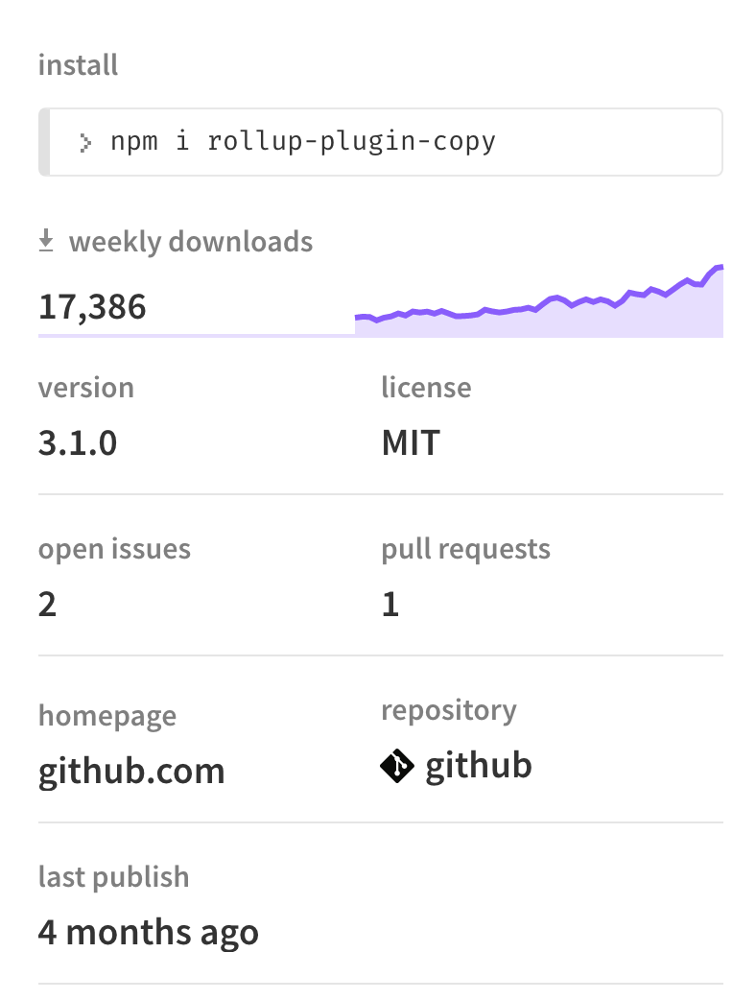
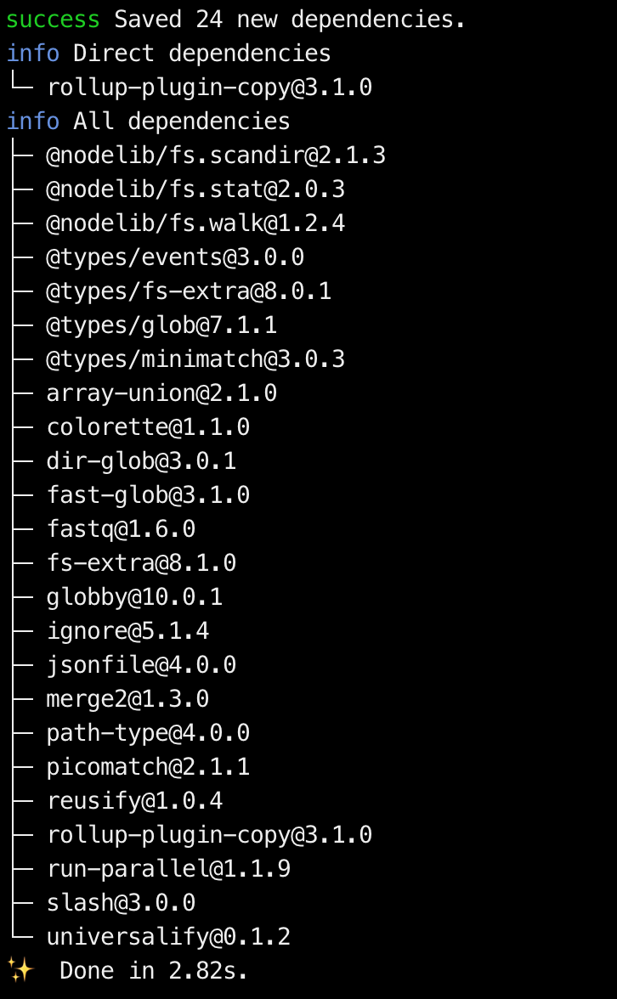

## Background

I was building a web application using [Svelte](http://svelte.dev/) and [Rollup](https://rollupjs.org/guide/en/) this morning. I needed to use a [web worker](https://developer.mozilla.org/en-US/docs/Web/API/Web_Workers_API/Using_web_workers), which the worker script has to be in another file:

```js
const worker = new Worker('/build/worker.js');
```

So naturally, I was thinking of having 2 entries for my rollup application: _the main app_ and _the worker_.

It works fine, except the fact that the [rollup-plugin-livereload](https://www.npmjs.com/package/rollup-plugin-livereload) injected a livereload script to every output file:

```js
/// filename: /build/worker.js
(function(l, r) { if (l.getElementById('livereloadscript')) return; r = l.createElement('script'); r.async = 1; r.src = '//' + (window.location.host || 'localhost').split(':')[0] + ':35729/livereload.js?snipver=1'; r.id = 'livereloadscript'; l.head.appendChild(r) })(window.document);

// worker code ...
```

The livereload script includes a reference to `window`, which is not available to the worker script:


I looked into [the docs of the rollup-plugin-livereload](https://www.npmjs.com/package/rollup-plugin-livereload), it doesn't seemed to have a option to exclude files from adding the _livereload script_.

At this point, I was thinking to myself, _"I just need to copy the worker.js into the 'build/' folder, I don't need anything else, how hard can that be?"_

It turns out harder than I imagined. 🤮

## Need something? Install a plugin!

In todays JavaScript landscape, there's a *"node_module"* for everything.

So I [googled](https://www.google.com/search?q=rollup+plugin+copy+files) _"rollup plugin copy files"_, without a suprise, there are multiple rollup plugins published to npm:


So I decided to install the first plugin, because it has the highest weekly downloads:



When I installed the plugin, I realise I was installing much more than I needed:



Remember, my use case is simple:

> **I just need to copy the worker.js into the 'build/' folder.**

I _don't need any bells and whistles_ this plugin is providing me. 🙈

So I uninstalled the plugin, thinking:

> How hard is it to **write a plugin** that **just** copy the worker.js into the 'build/' folder?

## Writing a Rollup plugin

Senpai once told me, _"writing rollup plugins is very straightforward,"_, yet, no one told me how to get started writing it.

So, I dug into `node_modules/`, and start skimming through the rollup plugins I have installed: [rollup-plugin-svelte](https://github.com/sveltejs/rollup-plugin-svelte), [rollup-plugin-node-resolve](https://github.com/rollup/rollup-plugin-node-resolve), [rollup-plugin-terser](https://github.com/TrySound/rollup-plugin-terser), ...

And I noticed a common pattern:

```js
/// filename: rollup-plugin-xxx.js
module.exports = function(options) {
  // ...
  return {
    name: 'plugin-name',
    load() { /* ... */ },
    resolveId() { /* ... */ },
    generateBundle() { /* ... */ },
    // ...
  }
}
```

So I guess, this is the general structure of a rollup plugin:
- It's an object, ...
- with a property called `name` for the name of the plugin,
- and functions like _"load"_, _"load"_, ... that would be called by rollup when the time is right 🤔

OK. I know what I need, I need to copy my `worker.js` when rollup is generating a bundle:

```js
/// filename: rollup.config.js
export default {
  plugins: [
    // ...
    // highlight-start
    {
      name: 'copy-worker',
      generateBundle() {
        fs.copyFileSync(
          path.resolve('./src/worker.js'),
          path.resolve('./public/build/worker.js')
        );
      }
    }
    // highlight-end
  ],
}
```

Great! It works! 😎

But, when I change the `worker.js` file, the `build/worker.js` is not updated. 😞

That's because the `worker.js` is not watched!

After much googling, I ended up reading through the official docs of [Rollup](https://rollupjs.org/guide/en/#plugin-development).

I learned that the functions like _"load"_, _"generateBundle"_, ... are called ["hooks"](https://rollupjs.org/guide/en/#hooks), and the docs explained when these hooks will be called, the arguments and the expected return value.

In the docs, I found [`this.addWatchFile(id: string)`](https://rollupjs.org/guide/en/#thisaddwatchfileid-string--void) under [plugin context](https://rollupjs.org/guide/en/#plugin-context), which according to the docs,

> [...] can be used to add additional files to be monitored by watch mode.

Sounds exactly what I am looking for! 😁

```js
export default {
  plugins: [
    // ...
    {
      name: 'copy-worker',
      // highlight-start
      load() {
        this.addWatchFile(path.resolve('./src/worker.js'));
      },
      // highlight-end
      generateBundle() {
        fs.copyFileSync(
          path.resolve('./src/worker.js'),
          path.resolve('./public/build/worker.js')
        );
      }
    }
  ],
}
```

Great! It works! 🎉🎉

## Closing Notes

After some researching, I wrote simple rollup plugin in 12 lines of code, that copies the worker.js into "build/" folder.

This is something custom and specific, and **it works perfectly fine**.

So, why would I install a package that has so many files and dependencies, just to do a simple and specific task?

**Am I going to publish my plugin to npm?**

No. If you have a similar use case, you are free to copy these 12 lines of code.

At the moment, I am having these 12 lines of code in my `rollup.config.js` and have no intention to extract it out into its own package.

**What about DRY? What if you/someone else have the same use case, wouldn't it great to have it as a package?**

Sorry. No. Before **DRY (Dont Repeat Yourself)**, there's **YAGNI (You aren't gonna need it)**.

Abstract code only when you need to.