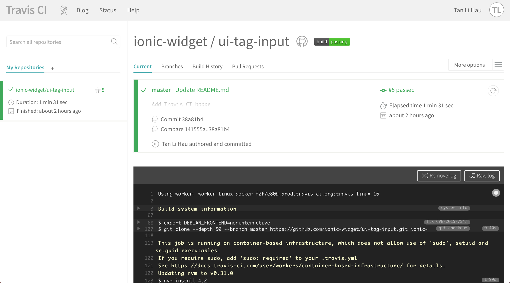
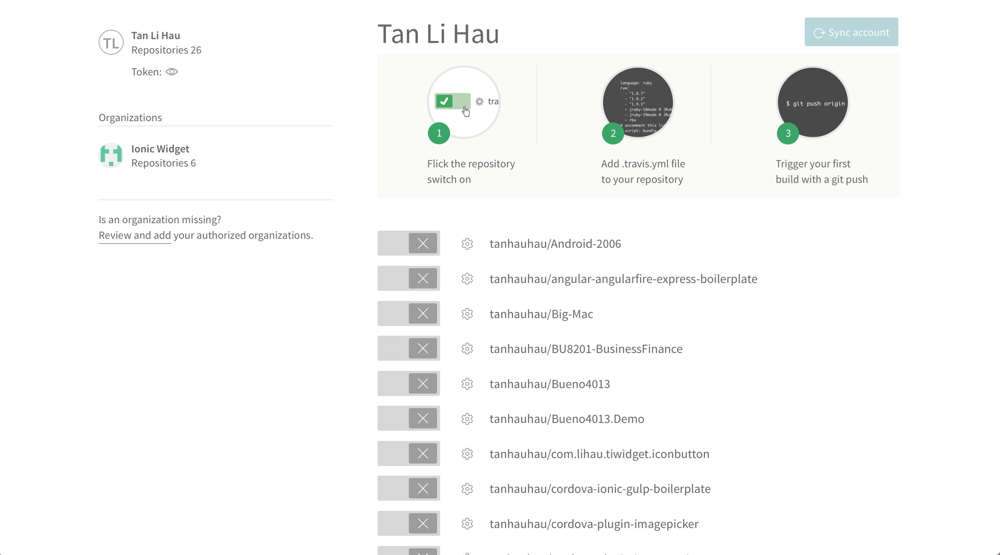
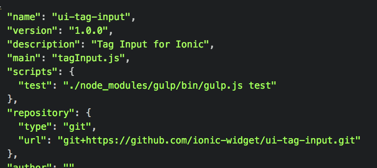
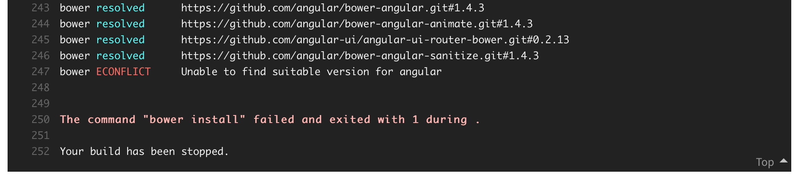
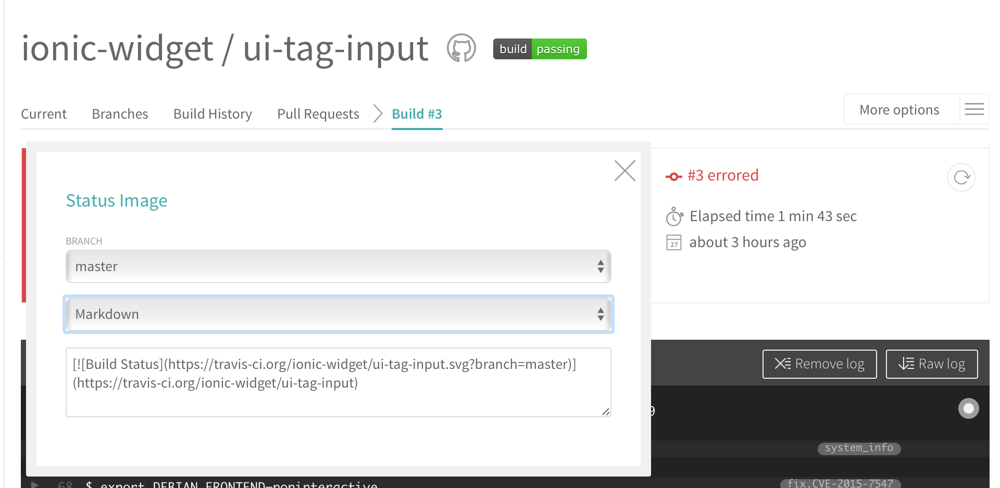
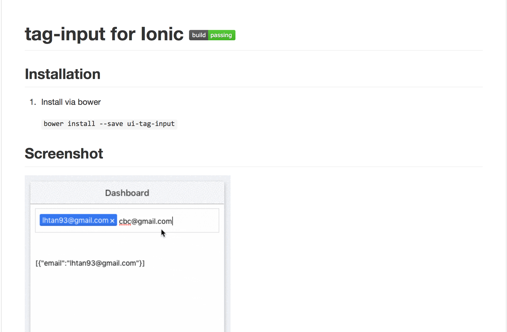

## 1. What is Travis CI
> **[Travis CI](https://travis-ci.org)** is a **Continuous Integration** service used to build and test software projects hosted at [GitHub](https://github.com).

Or in simple terms, when you push a commit to the master branch of your project hosted at GitHub, Travis CI will run tests and build the latest commit of your master branch.

It’s that simple. You push a commit → Travis CI run tests and build. Automatically.

## 2. How do I use Travis CI
Go to [Travis CI](https://travis-ci.org). Sign in using your GitHub account. You will be prompted to authorise Travis CI to your GitHub account. Approved that.

When you see something like this:



Voila. You have created a Travis CI account.

Next thing you are going to do is to click the `(+)` button beside the _“My Repositories”_ on the left.

You will then see a list of projects on your GitHub.



If the list of repositories is empty, click “Sync account” to fetch all your repositories.

Turn on one of your project for Continuous Integration!

That’s all.

## 3. How to build a Node.js project using Travis CI

Create a file name `.travis.yml` at the root folder of your project.

Copy this into the file.

**travis.yml:**
```yml
language: node_js
node_js:
  - 4.2
```

Commit and Push. That’s simple.

Or if you are lazy, run this:

```sh
curl https://gist.githubusercontent.com/tanhauhau/405e39884e80288615a7b51181fd5228/raw/9045c2e219547f0a228da630abff345d8add0c47/.travis.yml > .travis.yml
```


The version of Node.js I am using is 4.2 at the time of writing this article. To be safe, you can run “node — version” on your command line to determine which version of Node.js you are running.

> Make sure that you have all your dependencies persists to the package.json as Travis CI will install all the dependencies from it by calling npm install.

Another thing to take note is that if you wanna run your test script, make sure to include it in the `package.json`.



## 4. How do I use bower and install bower dependencies
If you are using bower, add a before_script for .travis.yml

```yml
language: node_js
node_js:
  - 4.2
before_script:
  - npm install -g bower
  - bower install
```

Or likewise if you are lazy, copy and paste this to your command line.

```sh
curl https://gist.githubusercontent.com/tanhauhau/71998bf221810186f046db94cda10c4e/raw/d1e8aee0981a96c20f94de6db386da048face423/.travis.yml > .travis.yml
```

One thing to take note for bower is that when there is dependency conflict, bower will ask you to choose which version of the dependency to be installed interactively. In the case for Travis CI, Travis CI will not know which version to install it for you where you will see an error like this:



> Therefore, you will have to [persists the resolution to bower.json](https://jaketrent.com/post/bower-resolutions/) to avoid the build error.

## 5. Include a Travis CI badge
To summarise, you have set up your Travis CI, copied and pasted the `.travis.yml` to your project, commited and pushed your project to GitHub, and Travis CI had built and tested your project.

Now, it’s time to add a badge to your GitHub repository!

Simply clicked the badge in Travis CI and choose for Markdown.



Copy and paste the line into your README.md.

Commit and Push.

And now you have a Travis CI badge on your repo!

