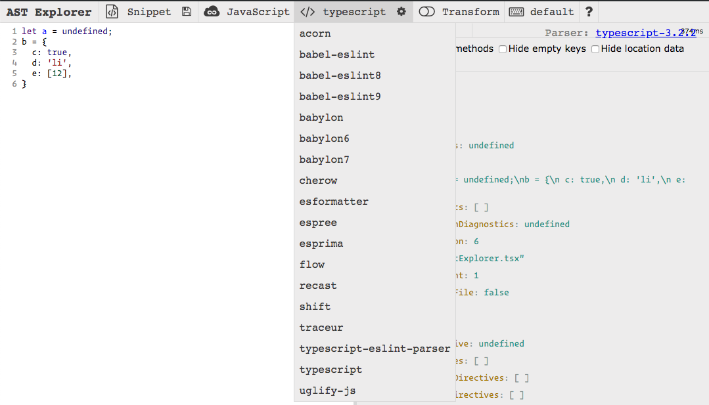
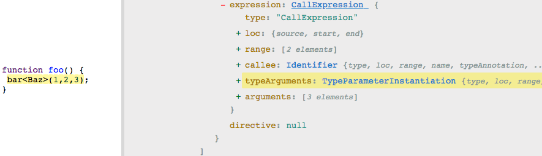
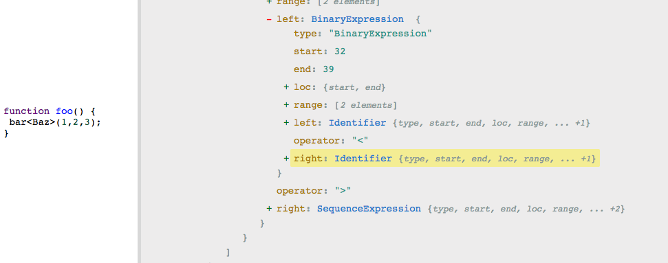

Today [Wei Gao](https://dev.wgao19.cc/) posed an interesting question:

She was upgrading Flow to v0.85, [which requires her to explicitly type the argument of the function call](https://medium.com/flow-type/asking-for-required-annotations-64d4f9c1edf8). However, when she saved the file, our [eslint-prettier](https://github.com/prettier/prettier) automatically format the code into a weird syntax:

So, when she wrote:

```js
fooFunction<Bar>(1, 2, 3);
```

With [eslint-plugin-prettier](https://github.com/prettier/eslint-plugin-prettier), eslint _“fixed”_ the code into:

```js
fooFunction < Bar > (1, 2, 3);
```

It felt like eslint sees `<` and `>` as the comparison operator, rather than `<Type>` as a whole!

To confirm with my hypothesis, I opened up my favourite tool for inspecting [AST](https://en.wikipedia.org/wiki/Abstract_syntax_tree): [astexplorer.net](https://astexplorer.net/)

---

You can paste your code into [astexplorer.net](https://astexplorer.net/) and see how different parser “sees” your code in terms of a AST (Abstract Syntax Tree).



As you can see from the picture above, you can choose from different parsers:

- **acorn** — the parser used by webpack after the loaders, webpack uses acorn’s AST to find `import` and `require()` syntax to know generate the dependency tree of your project, as well as provide an entry for plugins like [DefinePlugin](https://webpack.js.org/plugins/define-plugin/) to transform the transpiled code.
- **babylon**— the [babel](https://github.com/babel/babel/) parser, now it’s called [@babel/parser](https://babeljs.io/docs/en/babel-parser).
- **flow**, **typescript**, **uglify-js**— the parsers that each of the library uses
- **esprima** — the default eslint parser
- **babel-eslint** — a wrapper of babel parser for eslint, which is also the one we used, because we have a ton of babel plugins configured, so by using babel-eslint we don’t have to reconfigure the same plugins for eslint.

---

So I copied our code into astexplorer, and selected the “flow” parser:



I can see the type annotation is being parsed as “TypeParameterInstantiation”, however when I changed the parser to “babel-eslint8”,



I get a Binary Expression and a SequenceExpression!

---

**Binary Expression** is a way to express logical expression and mathematical expression, eg: `a + b` , `a && b` , `a <= b`, etc.

**Sequence Expression** on the other hand is something you don’t see people write that often, you can look up how it works in [Comma operator (MDN)](https://developer.mozilla.org/en-US/docs/Web/JavaScript/Reference/Operators/Comma_Operator), basically you can write expressions as a expression by joining them with a comma operator (`,`), and the expression returns the value of the last expression, eg: result = `(a++, b++, c -= 2, d.push(e), --f)`, you increment `a` , `b` , decrement `c` by 2, and pushed `e` into `d` and decrement `f` and set result to the new value of `f`. Wow, that’s a lot in one statement! It’s confusing to read, but you see this often in a minified code.

---

Now this explains why prettier will try to add space in between `<` and `>` .

I saw that there’s a babel-eslint9, and I gave it a try, and…


It seems like the bug was fixed on `babel-eslint9`, so I plowed through the release notes of babel-eslint, and I found this [merge commit](https://github.com/babel/babel-eslint/pull/444). So it seems like upgrading babel-eslint to v9 will solve the issue! 🎉