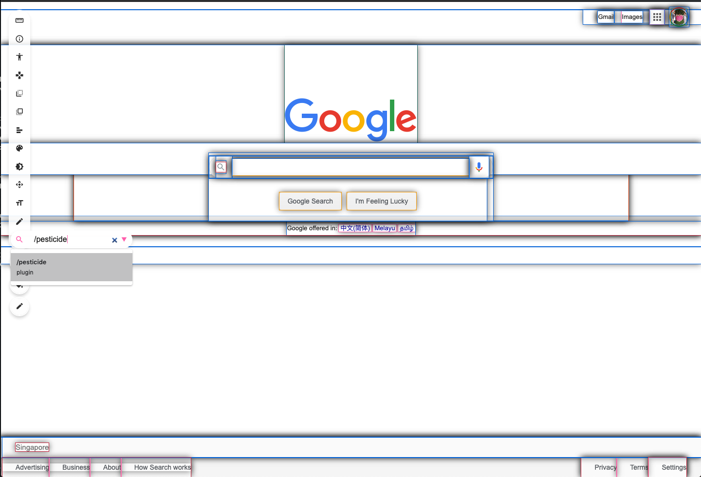

## 1️⃣ Natural stacking order

- Order of the element in the DOM.
- Last child in DOM tree appears in the frontmost
- CSS grid when assigning multiple elements into the same grid, without z-index, the order of stacking of the elements depends on their order in the DOM
- `flex-direction: reverse` does not change the stacking order

## 2️⃣ z-index

- can be positive / negative
- need to set position other than static, in order to work
  - need a position to make z-index to have context
- why z-index not working, position

## 3️⃣ negative z-index

- negative z-index goes behind the parent.
- html tag has base z-index, you can't go behind the `<html>`

```html
<div class="parent">
  <!-- child hidden behind parent -->
  <div class="child"></div>
</div>
<!-- child still visible, can't hide behind html body -->
<div class="child"></div>

<style>
  div {
    width: 100px;
    height: 100px;
  }
  .child {
    position: absolute;
    z-index: -1;
    background: green;
  }
  .parent {
    background: red;
  }
  body {
    background: blue;
  }
</style>
```

[Codepen](https://codepen.io/tanhauhau/pen/WNwvraL)

## 4️⃣ Highest z-index value

- Not mentioned in the spec, limited by the implementation (32-bit signed integer)
- (2^31)-1

## 5️⃣ Debugging z-index

- Layers panel
  
  

- visbug /zindex plugin
  
  
- visbug /pesticide plugin
  
  

[visbug extension](https://chrome.google.com/webstore/detail/visbug/cdockenadnadldjbbgcallicgledbeoc?hl=en)

## 6️⃣ Manage z-index

- using css custom properties
- name your z-index

```css
:root {
  --dialog-z-index: 1;
  --popup-z-index: 2;
}

.my-popup {
  z-index: var(--popup-z-index);
}

.my-dialog {
  z-index: var(--dialog-z-index);
}
```

## 7️⃣ stacking context

- html create the 1st stacking context
- To create stacking context
  - position + z-index not auto
  - when creating composite layer - filters, opacity, transform, will-change

```html
<div class="parent">
  <!-- z-index: 99 -->
  <div class="child1"></div>
</div>
<!-- z-index: 2 -->
<div class="child2"></div>

<style>
  div {
    width: 100px;
    height: 100px;
  }
  .parent {
    /* any of the following will create a new stacking context, */
    /* thus child2 will be on top of child1 */

    /* 1) position + z-index not auto */
    position: relative;
    z-index: 0;

    /*  2) filter  */
    filter: grayscale();

    /* 3) opacity < 1 */
    opacity: 0.9999999;

    /* 4) transform */
    transform: scale(1);

    /* 5) will change: transform, opacity, filter, z-index */
    will-change: opacity;
  }
  .child1 {
    background: green;
    position: absolute;
    top: 40px;
    left: 40px;
    z-index: 99;
  }
  .child2 {
    background: cyan;
    top: 20px;
    left: 20px;
    position: absolute;
    z-index: 2;
  }
</style>
```

[Codepen](https://codepen.io/tanhauhau/pen/NWNqxEe)

## Links

- [The CSS Podcast: 019: Z-Index and Stacking Context](https://podcasts.google.com/feed/aHR0cHM6Ly90aGVjc3Nwb2RjYXN0LmxpYnN5bi5jb20vcnNz/episode/NmZmNzlmOTgtNmM2NS00MjVhLWE0M2UtNTY1YmY4MjYxODU5?sa=X&ved=2ahUKEwiH-uH7_YzrAhWlGbcAHWJKBHcQkfYCegQIARAF)
- [Philip Walton: What no one told you about z-index](https://philipwalton.com/articles/what-no-one-told-you-about-z-index/) ([My Note](/notes/what-no-one-told-you-about-z-index))