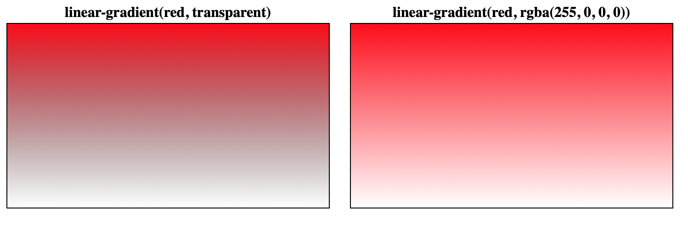
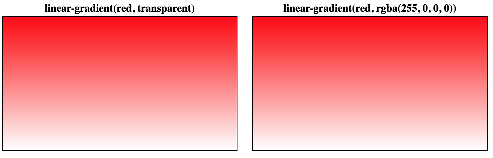

## CSS Gradients

Gradient is an image that smoothly fading from 1 color to another

**Color stops** - a color and a corresponding position on the gradient line
**Color transition hints** - a position to decide whether the middle point should be for the 2 color stops
**Color stop fixup** - automatically assigning a length to color stops

## linear-gradient()

```
linear-gradient(
  [ <angle> | to <side-or-corner> ]? ,
  <color-stop-list>
)
<side-or-corner> = [left | right] || [top | bottom]
```

angle

- example: 180deg, 3.14rad, 0.5turn
- to bottom, to right, to top left

```css
.element {
  linear-graident(pink, orange); /* default color transition hints at 50% */
  linear-gradient(pink, 50%, orange); /* color stop fixup, starting color at 0%, final color at 100% */
  linear-gradient(pink 0%, orange 100%);
  linear-gradient(pink 0%, 50%, orange 100%);
}
```

## radial-gradient()

```
radial-gradient(
  [ <ending-shape> || <size> ]? [ at <position> ]? ,
  <color-stop-list>
)
```

- ending shape is either circle / ellipse
- can provide ending shape or size
- if only passing size, if only 1 size -> circle, multiple sizes -> ellipse

- size
  - cannot be negative
  - absolute length (eg: 5rem, 10px) / relative length (eg: 30%)
  - closest-side, farthest-side, closest-corner, farthest-corner
    - the circle / ellipse must passes through

```css
<section>
  <div id="closest-side"></div>
  <div id="farthest-side"></div>
  <div id="closest-corner"></div>
  <div id="farthest-corner"></div>
</section>
```

```css
#closest-side {
  background: radial-gradient(circle closest-side, yellow 100%, 100%, red);
}
#farthest-side {
  background: radial-gradient(circle farthest-side, yellow 100%, 100%, red);
}
#closest-corner {
  background: radial-gradient(circle closest-corner at 30px 30px, yellow 100%, 100%, red);
}
#farthest-corner {
  background: radial-gradient(circle farthest-corner at 30px 30px, yellow 100%, 100%, red);
}
```


- Codepen https://codepen.io/tanhauhau/pen/poyRgOj?editors=1100

## conic-gradient()

- part of CSS images module level 4

```
conic-gradient() = conic-gradient(
  [ from <angle> ]? [ at <position> ]?,
  <angular-color-stop-list>
```

- color stops uses deg / rad / turn units

## repeating-linear-gradient, repeating-radial-gradient, repeating-conic-gradient

- same color stop list as `linear-gradient`, `radial-gradient`, `conic-gradient`
- common pitfall of gradient not repeating is because gradient size of 100%
- tip: use % based color stops for fixed size gradient, length based color stops for unknown size gradient
- tip: pair it with background size, repeat and position to create a pattern
  - https://leaverou.github.io/css3patterns/

## animating repeating-conic-gradient

- from https://lea.verou.me/ header
- using CSS Houdini to make css variable animatable

```html
<style>
  div {
    background: repeating-conic-gradient(from calc(var(--number, 0) * 1turn) at center, red 0 4deg, transparent 0 8deg) fixed;
    animation: to1 600s linear infinite;
  }
  @keyframes to1 {
    to {
      --number: 1;
    }
  }
</style>
<script>
  if (window.CSS && CSS.registerProperty) {
    CSS.registerProperty({
      name: '--number',
      syntax: '<number>',
      inherits: true,
      initialValue: '0',
    });
  }
</script>
```

## Avoid `transparent`

- avoid transparent in gradients
- maybe transitioning to white transparent / black transparent

safari:


chrome:


Links:

- CSS Image Module Level 3 - Gradients https://www.w3.org/TR/css-images-3/#gradients
- CSS Image Module Level 4 - Gradients https://drafts.csswg.org/css-images-4/#gradients
  - conic-gradient, repeating-conic-gradient
- Gradient generator https://www.colorzilla.com/gradient-editor/
- Cicada Principle https://lea.verou.me/2020/07/the-cicada-principle-revisited-with-css-variables/