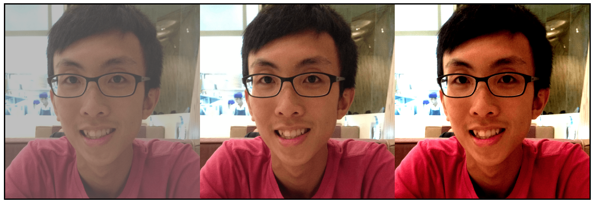

## CSS Filters

- applied in order provided
- you can use filter functions or url to svg filters

```css
.element {
  filter: blur(1px);
  filter: url(#blur);
  filter: url(commonfilters.xml#blur);
}
```

### blur()
- uses gaussian blur
- specify blur radius

```css
.center {
  filter: blur(3px);
}
.right {
  filter: blur(10px);
}
```


### brightness()
- takes in percentage value
- greater than 100% - lightening
- less than 100% - darkening
- 0 - complete black

```css
.left {
  filter: brightness(0.5)
}
.right {
  filter: brightness(1.5)
}
```


### contrast()
- takes in percentage value
- greater than 100% - increasing contrast
- less than 100% - decreasing contrast

```css
.left {
  filter: contrast(0.5)
}
.right {
  filter: contrast(1.5)
}
```



### grayscale()
- grayscale vs desaturation
  - grayscale: perceptual information of the color will be maintained


### invert()
- inverts the dark and light
- `invert(1)` is the default, which completely inverts
- `invert(0.5)` will end up a 50% color gray (light increase and dark decrease at the same amount and meet at 50%)
- can be used to implement dark mode (invert everything, then invert the image again)

### opacity()
- similar to opacity property

### saturate()
- takes in percentage value
- greater than 100% - increasing saturation
- less than 100% - decreasing saturation

### sepia()
- sepia has a warm, yellow/brown appearance
- takes in percentage value
- value from 0% - 100%, 100% is complete sepia, 0% is no effect

### hue-rotate()
- rotates the color along the color wheel
- takes in an angle

### drop-shadow()
- works on the painted space instead of the box
- not casting shadow if it is transparent

### url()
- point to svg filter
- svg must be inline, cannot be a url as an image, so that it can be referenced

```html
<style>
  .element {
    filter: url(#my-filter)
  }
</style>
 
<svg>
  <filter id="my-filter">
     <feGaussianBlur in="SourceGraphic" stdDeviation="5" />
  </filter>
</svg>
```

### `backdrop-filter`
- apply behind the element, instead on the element
- https://css-tricks.com/almanac/properties/b/backdrop-filter/

## SVG Filters

### Color Matrix

- https://alistapart.com/article/finessing-fecolormatrix/
- https://css-tricks.com/color-filters-can-turn-your-gray-skies-blue/


- feMerge

svg filter effects
fe color matrix
- 4x4 matrix
[1000,0100,0010,0001]
- a


svg filter

feBlend
- just like how blend mode works
feComponentTransfer 

feComposite
pixel level image interactions, how each pixels composite together

feConvolve
how pixels interacte with its neighbour, this results in blurring, sharpening

feDiffuseLighting
defines a light source

feDisplacementMap
displaces an image, in, using another image in2 to displace the in image

feFlood
fills the filter subregion with the specified color and opacity

feGaussianBlur
same as what `blur()` use

feImage
to use with other filters, feBlend or feComposite

feMerge
asynchronous operations in the filter effects instead of layering them

feMorphology
erods or dilates the input image

feOffset
useful for creating dropShadow

feSpecularLighting
use alpha channel as bump map

feTile
how image repeated to fill the space

feTurbulence
creates image using Perlin turbulence function

https://www.w3.org/TR/filter-effects-1/#ShorthandEquivalents

<style>
  img {
    width: 300px;
  }
</style>

- https://tympanus.net/codrops/2019/01/15/svg-filters-101
- https://www.sarasoueidan.com/blog/compositing-and-blending-in-css/
- https://alistapart.com/article/finessing-fecolormatrix/
- https://css-tricks.com/color-filters-can-turn-your-gray-skies-blue/
- https://css-tricks.com/look-svg-light-source-filters/