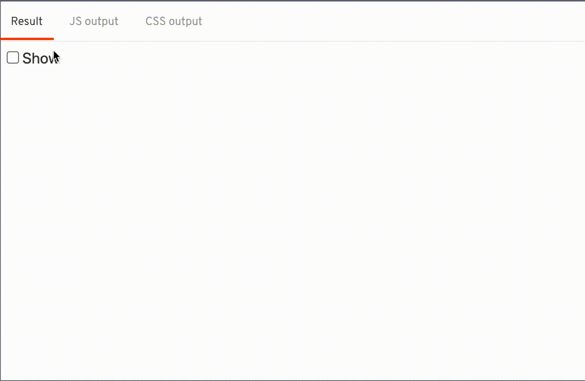
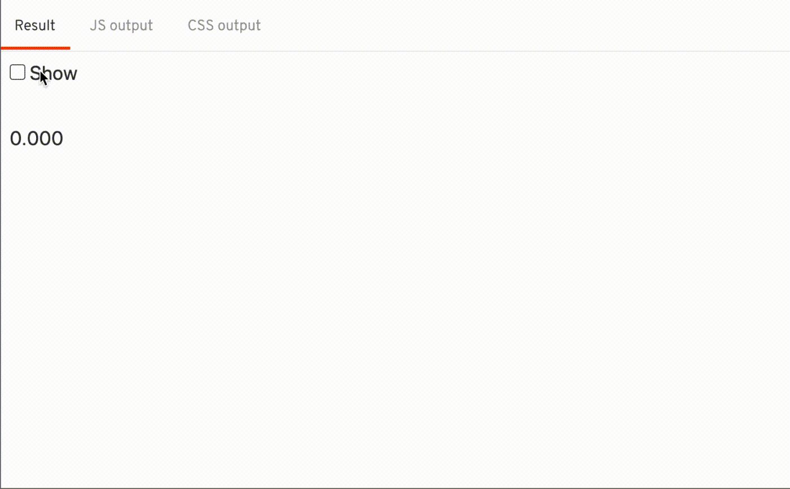
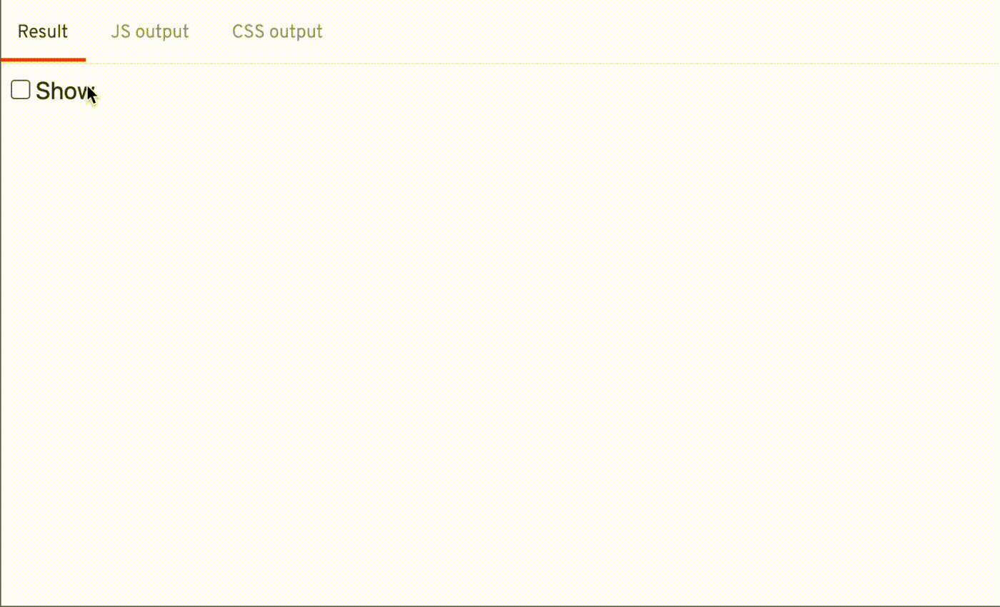

## The Result



## Break it down slowly


The transition can be broken down into 2 halves:

- 1️⃣ a solid color growing from the left covering the whole text area
- 2️⃣ as the solid color shrinks, it reveals the text

### 1. The first thing is to figure out the color of the text

```js
function swipeColor(node, params) {
  const { color } = window.getComputedStyle(node);
}
```

### 2. I tried using linear-gradient to draw the background

- I use the value of `t` to determine how wide the solid color should be

```js
css(t) {
  if (t > 0.5) {
    // transform t from range [0.5, 1] into percentage [0, 100]
    // t: 0.5 -> 1
    // u: 0 -> 0.5
    const u = t - 0.5;
    // percentage: 0 -> 100
    const percentage = u * 200;
    return `background: linear-gradient(to right, transparent 0, ${percentage}%, ${color} ${percentage}%);`;
  } else {
    // transform t from range [0, 0.5] into percentage [0, 100]
    // t: 0 -> 0.5
    // percentage: 0 -> 100
    const percentage = t * 200;
    return `background: linear-gradient(to right, ${color} 0, ${percentage}%, transparent ${percentage}%);`;
  }
},
```



### 3. Next I need to hide / reveal the text at the right time

- I hid the text by setting the text color to transparent

```js
css(t) {
  if (t > 0.5) {
    return `color: ${color}`;
  } else {
    return `color: transparent`;
  }
}
```


### 4. Combining the both 2. and 3. together

```js
css(t) {
  if (t > 0.5) {
    // transform t from range [0.5, 1] into percentage [0, 100]
    // t: 0.5 -> 1
    // u: 0 -> 0.5
    const u = t - 0.5;
    // percentage: 0 -> 100
    const percentage = u * 200;
    return `
      background: linear-gradient(to right, transparent 0, ${percentage}%, ${color} ${percentage}%);
      color: ${color};
    `;
  } else {
    // transform t from range [0, 0.5] into percentage [0, 100]
    // t: 0 -> 0.5
    // percentage: 0 -> 100
    const percentage = t * 200;
    return `
      background: linear-gradient(to right, ${color} 0, ${percentage}%, transparent ${percentage}%);
      color: transparent;
    `;
  }
},
```

### 5. final touches, pass the `duration`, `delay`, and `easing` into the returned object

```svelte
<script>
  function swipeColor(node, params) {
    const { duration, delay, easing } = params || {};
    return {
      duration,
      delay,
      easing,
      css(t) { /* ... */ },
    };
  }
</script>

{#if show}
  <span transition:swipeColor>Hello world</span>
  <span transition:swipeColor={{ delay: 300 }}>Hello world</span>
{/if}
```

## Final code

```js
function swipeColor(node, params) {
  const { duration, delay, easing } = params || {};
  const { color } = window.getComputedStyle(node);
  return {
    duration,
    delay,
    easing,
    css(t) {
      if (t > 0.5) {
        // transform t from range [0.5, 1] into percentage [0, 100]
        // t: 0.5 -> 1
        // u: 0 -> 0.5
        const u = t - 0.5;
        // percentage: 0 -> 100
        const percentage = u * 200;
        return `
          background: linear-gradient(to right, transparent 0, ${percentage}%, ${color} ${percentage}%);
          color: ${color};
        `;
      } else {
        // transform t from range [0, 0.5] into percentage [0, 100]
        // t: 0 -> 0.5
        // percentage: 0 -> 100
        const percentage = t * 200;
        return `
          background: linear-gradient(to right, ${color} 0, ${percentage}%, transparent ${percentage}%);
          color: transparent;
        `;
      }
    },
  };
}
```

## Extra

Svelte has make writing custom transitions simple, with the code above, the transition itself is able to pause / reverse halfway through the transition

