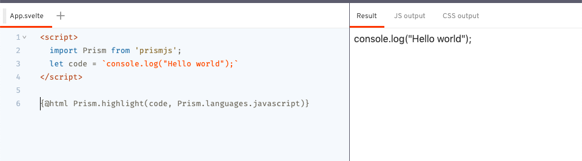
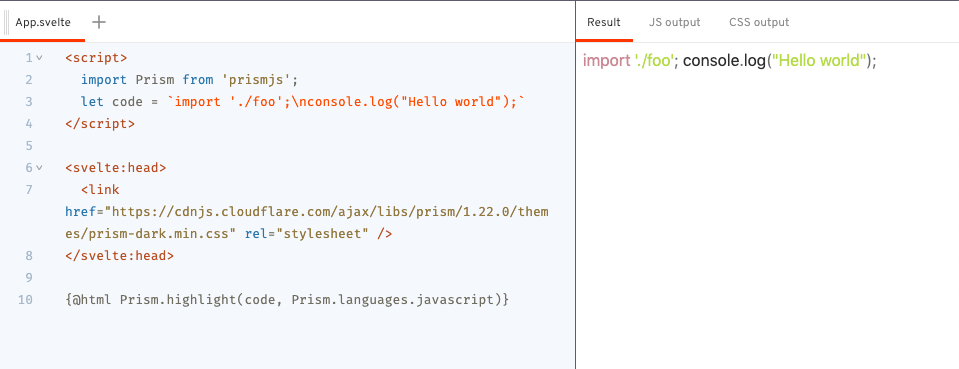

I've been using Svelte to show code snippets, such as [this](https://svelte.dev/repl/30153d68324d475189d34afa26a3186f?version=3.29.0) and [this](https://svelte.dev/repl/51e813279e2247809426f40d88faf84e?version=3.29.0), in which the code are dynamically generated and highlighted in the browser. In these examples, I used [Prism](https://prismjs.com/) to do syntax highlighting.

## tl;dr

- Prism provides an API, `Prism.highlight(code, language)`, which returns a highlighted HTML.
- Use `{@html}` or Svelte actions, `use:` to insert the highlighted HTML into Svelte component
- Need special handling of `\n` newline character, space and tab character.

## Snippet

```svelte
<script>
  import Prism from 'prismjs';
  export let code;
  export let language;
</script>

<div class="code">
  {@html Prism.highlight(code, Prism.languages[language])}
</div>

<svelte:head>
  <link href="https://cdnjs.cloudflare.com/ajax/libs/prism/1.22.0/themes/prism-dark.min.css" rel="stylesheet" />
</svelte:head>

<style>
  .code {
    white-space: pre-wrap;
  }
</style>
```

## Highlighting with Prism

Prism provides an API `Prism.highlight(code, language)`, which returns a highlighted HTML:

```svelte
<script>
  import Prism from 'prismjs';
  let code = 'console.log("Hello world");';
  let html = Prism.highlight(code, Prism.languages.javascript);
</script>
```

To insert the HTML into the Svelte component, you can use `{@html}`

```svelte
<script>
  import Prism from 'prismjs';
  let code = 'console.log("Hello world");';
</script>

{@html Prism.highlight(code, Prism.languages.javascript)}
```

or Svelte actions

```svelte
<script>
  import Prism from 'prismjs';
  let code = 'console.log("Hello world");';

  function prism(node, code) {
    node.innerHTML = Prism.highlight(code, Prism.languages.javascript);
    return {
      update(code) {
        node.innerHTML = Prism.highlight(code, Prism.languages.javascript);
      }
    }
  }
</script>

<div use:prism={code} />
```



At this point, you may not see any syntax highlighting yet, that's because you need to add `prism.css` or any other prism theme CSS.

```svelte
<svelte:head>
  <link href="https://cdnjs.cloudflare.com/ajax/libs/prism/1.22.0/themes/prism-dark.min.css" rel="stylesheet" />
</svelte:head>

<script>
  import Prism from 'prismjs';
  let code = 'console.log("Hello world");';
</script>

{@html Prism.highlight(code, Prism.languages.javascript)}
```

You can find more Prism themes over [prism themes](https://github.com/PrismJS/prism-themes).

If you have a multiline code, you may notice that they all appear in 1 single line.



That's because Prism syntax highlighting still maintains the newline character `\n`.

You can either wrap the html within a `<pre>` tag:

```svelte
<pre>
  {@html html}
</pre>
```

or, replace all the `\n` to `<br />`:

```svelte
{@html html.replace(/\n/g, '<br />')}
```

or, with CSS:

```svelte
<div>
  {@html html}
</div>

<style>
  div {
    white-space: pre-wrap;
  }
</style>
```

However, if you are not using the CSS `white-space` property or a `<pre>` tag, you may need to preserve white-space such as tab or space in the beginning of each line too, for proper indentation of your code:

```svelte
{@html html
  .split('\n')
  .map(str => str.replace(/^(\s+)/, (_, space) => '<span class="tab"></span>'.repeat(space.length)))
  .join('<br />')}

<style>
  :global(span.tab) {
    display: inline-block;
    width: 2ch;
  }
</style>
```

To support syntax highlighting for different languages, you can install them. In most cases, they will be enhancing the Prism "automatically"

### With `prism-svelte`

```svelte
<script>
	import Prism from 'prismjs';
  import 'prism-svelte';
  let code = `
{#each list as item}
  <div>{item}</div>
{/each}`.trim();
<script>

{@html Prism.highlight(code, Prism.languages.svelte)}
```

### With `diff-highlight`

```svelte
<script>
	import Prism from 'prismjs';
	import 'prismjs/components/prism-diff';
	import 'prismjs/plugins/diff-highlight/prism-diff-highlight';

	let code = `
+ console.log('a');
- console.log('b');
  console.log('c');
`
</script>

<div>
	{@html Prism.highlight(code, Prism.languages['diff'], 'diff-javascript')}
</div>
```