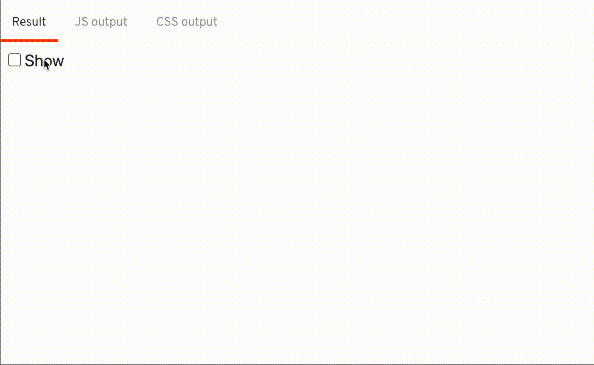
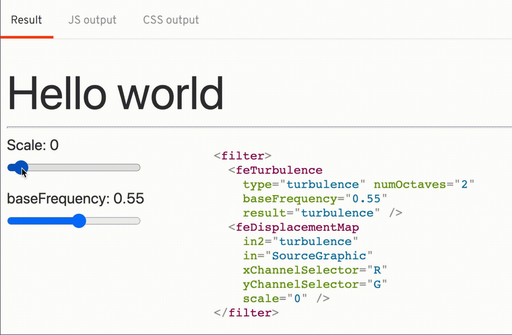

## The Result



## Break it down

I'm using a combination of SVG filters `<feTurbulence>`, `<feDisplacementMap>` to achieve this effect.

[Svelte REPL](https://svelte.dev/repl/fc2c47f30912496eb0b4fe2776345462?version=3.29.4)



To use this SVG filter, I first created a Svelte component for the filter.

The idea is to add this render this filter whenever I want to transition, and update the scale and frequency during the transition

```svelte
<script>
  export let baseFrequency = 0;
  export let scale = 0;
  export let id;
</script>

<svg height="0" width="0">
  <filter {id}>
    <feTurbulence
      type="turbulence" numOctaves="2"
      {baseFrequency}
      result="turbulence" />
    <feDisplacementMap
      in2="turbulence" in="SourceGraphic"
      xChannelSelector="R" yChannelSelector="G"
      {scale} />
  </filter>
</svg>
```

As I'm going to have multiple instance of the SvgFilter, and I don't want the filter id to be conflict with each other, I generated the `id` everytime there's a new instance of `SvgFilter`

```svelte
<script context="module">
  let _idx = 0;
</script>

<script>
  // ...
  export let id = `wave-${_idx++}`;
</script>
```

I created the `SvgFilter` component as the transition starts and remove it as the transition ends

```js
import SvgFilter from './SvgFilter.svelte';

function wavy(node, params = {}) {
  let svgFilter;
  		
  node.addEventListener('introstart', createIntro);

  // create SvgFilter
  function createIntro() {
    svgFilter = new SvgFilter({ target: document.body });
    node.style.filter = `url(#${svgFilter.id})`;
    node.removeEventListener('introstart', createIntro);
    node.addEventListener('introend', cleanup);
  }

  function cleanup() {
    svgFilter.$destroy();
    node.removeEventListener('introend', cleanup);
  }
  // ...
}
```

And as the transition ticks by, I set the `scale` of the SVG filter based on the time, `t`

```js
function wavy(node, params = {}) {
  let svgFilter;

  // ...
  return {
    ...params,
    tick(t) {
      // t     0   -> 1
      // scale 100 -> 0
      if (svgFilter) 
        svgFilter.$set({
          scale: (1 - t) * 100,
          baseFrequency: 0.55,
        });
    }
  }
}
```

Add some fade out using the opacity

```js
function wavy(node, params = {}) {
  let svgFilter;

  // ...
  return {
    ...params,
    css(t) {
      // only fade out in the last quarter of the time
      // t       1 -> 0.25 -> 0
      // opactiy 1 -> 1    -> 0
      return t < 0.25 ? `opacity: ${t * 4}` : 'opacity: 1';
    }
    tick(t) {
      // t     0   -> 1
      // scale 100 -> 0
      if (svgFilter) 
        svgFilter.$set({
          scale: (1 - t) * 100,
          baseFrequency: 0.55,
        });
    }
  }
}
```

[Final REPL](https://svelte.dev/repl/2f3f9b62e1454f2d94729fe242375d43?version=3.29.4)