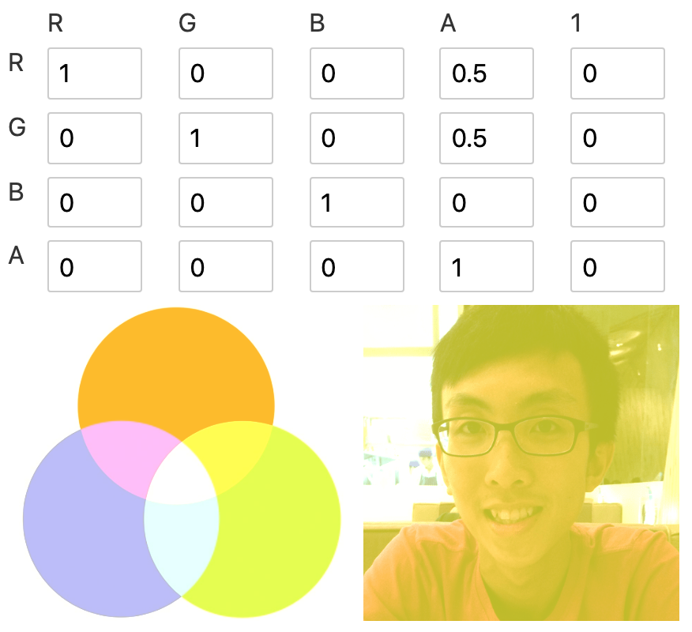

<script>
  import Morphology from './components/Morphology.svelte';
  import KnockoutText from './components/KnockoutText.svelte';
</script>

## SVG Filters 101

[ [Source](https://tympanus.net/codrops/2019/01/15/svg-filters-101/) ]


- defined in `<filter>` element
- define a series of one or more filter primitives
- 1 filter primitive performs **1 single fundamental graphic operation** on **one or more** inputs

### filter primitives
- filter primitives named start with `fe`, short for "filter effect"
- filter primitives take 1-2 inputs and output 1 result
- `in` and `in2` attribute for input, `result` attribute for output
- input takes in result, `SourceGraphic` and `SourceAlpha`

```html
<svg>
  <filter id="my-filter">
    <!-- take in 1 input `in` -->
    <feGaussianBlur in="INPUT_NAME" />

    <!-- take in 2 inputs `in` and `in2` -->
    <feComposite in="INPUT_NAME_1" in2="INPUT_NAME_2" />
    
    <!-- `result` defines the result name, 
		which can be passed in as input for the next filter -->
    <feGaussianBlur result="OUTPUT_1" />
    <feGaussianBlur in="OUTPUT_1" />
    
    <!-- use the source as input for the filter primitive -->
    <!-- apply filter on the source element -->
	<feGaussianBlur in="SourceGraphic" />

    <!-- apply filter on the alpha channel of the source element,
		the silhouette of the source -->
	<feGaussianBlur in="SourceAlpha" />
  </filter>
</svg>
```

### Filter region
- filter region is based on the bounding box of the element
- filter result beyond filter region will be clipped off
- default filter region extends 10% the width and height of bounding box in all 4 directions

```html
<!-- x, y, width, height sets the filter region -->
<filter
  x="-10%" y="-10%" width="120%" height="120%"
  filterUnits="objectBoundingBox">
  <!-- filter primitives here -->
</filter>
```

- use `<feFlood>` to figure out the filter region
  
```html
<filter>
  <feFlood
    flood-color="#EB0066" flood-opacity="0.5"
    result="flood"></feFlood>
  <feMerge>
    <feMergeNode in="SourceGraphic" />
    <feMergeNode in="flood" />
  </feMerge>
</filter>
```

### Create a drop shadow

1. Blur the silhouette of the layer

```xml
<filter id="my-filter">
  <feGaussianBlur
    in="SourceAlpha" stdDeviation="10" result="DROP" />
</filter>
```


2. Composite the blur layer with a solid color layer to create a colored blur
- Learn compositing + blending in https://www.sarasoueidan.com/blog/compositing-and-blending-in-css/

```xml
<filter id="my-filter">
  <feGaussianBlur in="SourceAlpha" stdDeviation="10" result="DROP"></feGaussianBlur>
  <feFlood flood-color="#EB0066" result="COLOR" />
  <feComposite in="COLOR" in2="DROP" operator="in" result="SHADOW" />
</filter>
```


3. Shift the shadow bottom-right with `<feOffset>`

```xml
<filter id="my-filter">
  <feGaussianBlur in="SourceAlpha" stdDeviation="10" result="DROP"></feGaussianBlur>
  <feFlood flood-color="#EB0066" result="COLOR" />
  <feComposite in="COLOR" in2="DROP" operator="in" result="SHADOW" />
  <feOffset in="SHADOW" dx="10" dy="10" result="DROPSHADOW" />
</filter>
```


4. Combine the shadow with the original image
- layer merge in order of declaration, latter layer stacks on top of previous layer

```xml
<filter id="my-filter">
  <feGaussianBlur in="SourceAlpha" stdDeviation="10" result="DROP"></feGaussianBlur>
  <feFlood flood-color="#EB0066" result="COLOR" />
  <feComposite in="COLOR" in2="DROP" operator="in" result="SHADOW" />
  <feOffset in="SHADOW" dx="10" dy="10" result="DROPSHADOW" />
  <feMerge>
    <feMergeNode in="DROPSHADOW" />
    <feMergeNode in="SourceGraphic" />
  </feMerge>
</filter>
```


## Finessing `feColorMatrix`

[ [Source](https://alistapart.com/article/finessing-fecolormatrix/) ]

```xml
<filter id="linear">
  <feColorMatrix
    type="matrix"
    values="R 0 0 0 0
            0 G 0 0 0
            0 0 B 0 0
            0 0 0 A 0 "/>
</filter>
```

```js
/* R G B A 1 */
1 0 0 0 0 // R = 1*R + 0*G + 0*B + 0*A + 0
0 1 0 0 0 // G = 0*R + 1*G + 0*B + 0*A + 0
0 0 1 0 0 // B = 0*R + 0*G + 1*B + 0*A + 0
0 0 0 1 0 // A = 0*R + 0*G + 0*B + 1*A + 0
```

- [color matrix playground](https://svelte.dev/repl/1fa3e758ef2442d1bcc1eba37a2bdd58)

### 1. Colorizing


- Removing other color to colorise image into the remaining color
- colorise red -> remove blue & green

- colorise yellow -> remove blue (red + green = yellow)


### 2. Alpha values

- add opacity level to the red channel
  - any red remaining red
  - green -> yellow (red + green = yellow)
  - blue -> magenta (red + blue = magenta)

- hard yellow filter


- have a value some where between 0-1 to see the mixture in the shadow



- negative value could offset the channel by the amount of opacity

  - the following 2 color matrix is identical
```xml
<filter>
  <feColorMatrix
    type="matrix"
    values="1  0  0  0  0
            0  1  0  0  0
            0  0  1 -1  0
            0  0  0  1  0 "/>
</filter>

<filter>
  <feColorMatrix
    type="matrix"
    values="1  0  0  0  0
            0  1  0  0  0
            0  0  0  0  0
            0  0  0  1  0 "/>
</filter>
```

### 3. Blowing out channels
- turn 1 color to white
- set the alpha channel to `-2`


### 4. Change color
- No more green, any green looks like magenta now. (luminosity of green is lost)


### 5. Lighten or darken
- increase intensity to lighten, decrease to darken


### 6. Grayscale
- make sure red, green, blue have the same value


## Outline Text with `<feMorphology>`

[ [Source](https://tympanus.net/codrops/2019/01/22/svg-filter-effects-outline-text-with-femorphology/) ]

- 🖼 image size gets smaller when `erode`, larger when `dilate`
- 🖼 image looks like painted with large brush 🖌
- 📝 `erode` sets each pixel to the darkest / most transparent neighbor
- 📝 `dilate` sets each pixel to the brightest / least transparent neighbor

```html
<filter>
  <feMorphology 
    in=".." result=".." 
    operator="dilate || erode" radius="" />
</filter>
```


<Morphology />

[REPL](https://svelte.dev/repl/1f0a2c16650541d082beeecc2a046c9f?version=3.29.0) to see effect with different radius.

### Adding Colored Outline to Text with `<feMorphology />`

1️⃣ expand the text with `<feMorphology operator="dilate" />`
2️⃣ colorize via `<feFlood>` with solid color and `<feComposite />`
3️⃣ merge the expanded colored text with the original text

```html
<h1 style="filter: url(#outline)">Hello World</h1>

<svg>
	<filter id="outline">
		<feMorphology result="THICK" operator="dilate" radius="4" />
		<feFlood flood-color="#32DFEC" flood-opacity="1" result="COLOR" />
		<feComposite in="COLOR" in2="THICK" operator="in" result="OUTLINE" />
		<feMerge>
			<feMergeNode in="OUTLINE" />
			<feMergeNode in="SourceGraphic" />
		</feMerge>
	</filter>
</svg>
```


[REPL](https://svelte.dev/repl/a1a3aa1cc844476b9ca96fec3f0164ed?version=3.29.0) to visualise `<feMorphology>`

### Knockout text with `<feMorphology />`

1️⃣ expand the text with `<feMorphology operator="dilate" />`
2️⃣ composite with the source with `<feComposite />` using `out` operator

```html
<h1 style="filter: url(#outline)">Hello World</h1>

<svg>
	<filter id="outline">
		<feMorphology result="THICK" operator="dilate" radius="4" />
		<feComposite in="THICK" in2="SourceGraphic" operator="out" />
	</filter>
</svg>
```


<KnockoutText />

[REPL](https://svelte.dev/repl/30153d68324d475189d34afa26a3186f?version=3.29.0) to visualise the build up the knock-out text.

