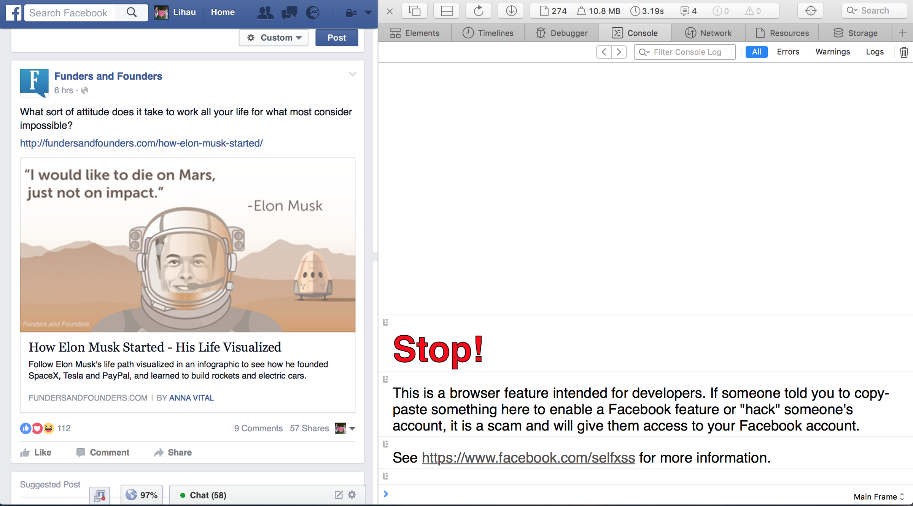
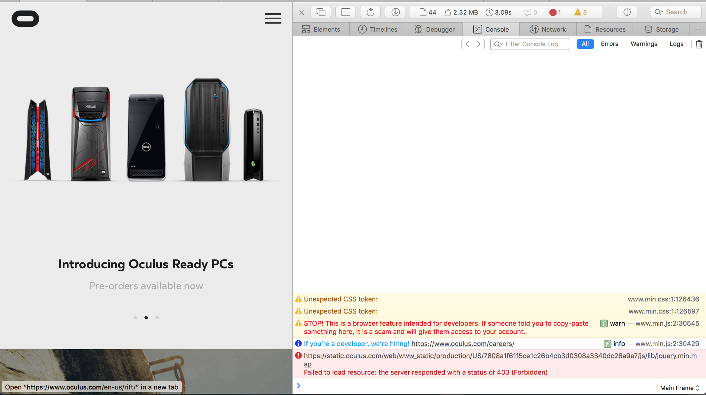
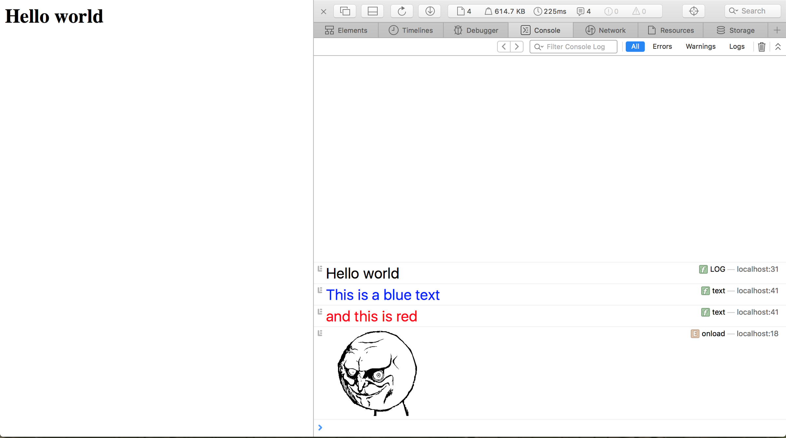

On one normal day, I opened up my browser’s developer console for no reason. The page I was on, at that moment, was Facebook. And I saw a big red “Stop” in the console, and followed by a big bolded text of “This is a browser feature intended for developers….”.



I paused for a while, amazed by what I’ve discovered randomly. This is quite interesting and I have two questions come up to my mind.

## 1. Is Facebook the only site that leaves message in the console?
It turns out to be **NO. It’s not just Facebook.**


This is what I found out after some random searches: Oculus and Coursera are hiring people through the console!


Oculus hiring people through the console


Coursera did the same thing too!

It seems like this is a good place to hire web stack developer. Since the only person who is going to look into the console of your page is a web developer, or a full stack developer, hiring them through your console isn’t a bad idea after all.

## 2. How did the Facebook printed out a styled text in the console?
Actually it turns out it is very simple indeed. You can follow [the StackOverflow thread](http://stackoverflow.com/a/22156044/1513547) to see how it is done.

## 3. So can the console print out images?
It’s a **YES** again. But how?

You can refer to this awesome [console.image](https://github.com/adriancooney/console.image) library developed by adriancooney. He will explain how he did it to you.

## So, why not create an express middleware for this?
This was the random idea that came out from my mind after seeing websites leaving messages in the console. Why not have an express middleware that injects a script that prints to the console for each html pages served from the [express server](http://expressjs.com/). It should have an simple intuitive API, and should not pollute to the global namespace at all.

So, [this is what I’ve come up](https://www.npmjs.com/package/express-console-warning).

I know, the name is mouthful and awkward. This is because initially I intended the middleware to just print out a warning message. After a bit of consideration, turns out that hiring in the console should be a good use case too. But the name of the package just stuck there.

So, how do you use it?

It’s simple. See the code snippet below:

```js
var express = require('express'),
        app = express(),
	hr = require('express-console-warning');
	
app.use(hr.LOG('Hello world')
	  .text('This is a blue text', {color: 'blue', fontSize: 'x-large'})
	  .text('and this is red', {color: 'red', fontSize: 'x-large'})
	  .image('http://memesvault.com/wp-content/uploads/Best-Meme-Faces-14.png',0.1)
	  .build());
app.use(express.static('client'));
```

And there you go.



_Disclaimer: I did not own the meme. I got the link from Google search just to try out the API._

## Conclusion
So, these are what I’ve learned from a random action (open the developer console) and what I’ve created from it (express-console-warning).

express-console-warning [github](https://github.com/tanhauhau/express-console-warning) [npm](http://npmjs.com/package/express-console-warning)