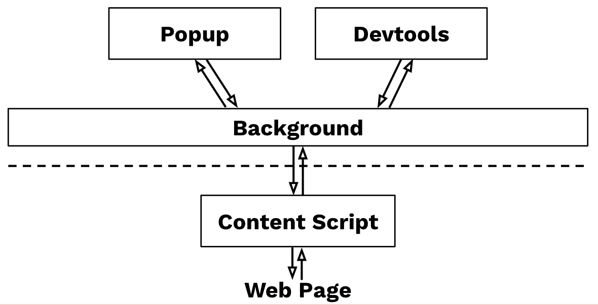
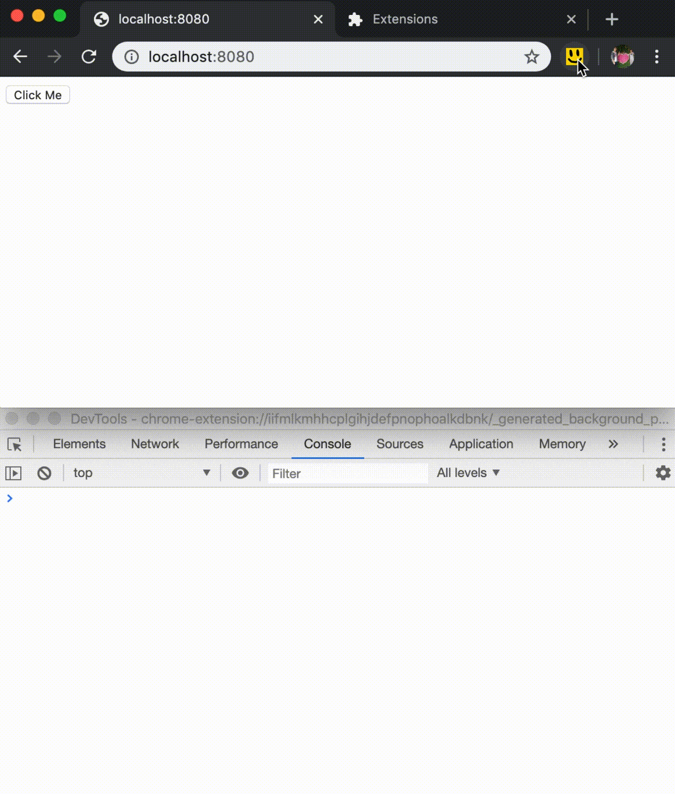

I prepared this talk for Chrome Dev Summit Extended 2020 in Singapore. Unfortunately, due to the Coronavirus Outbreak, and having the Ministry of Health raising the alert to DORSCON Orange, the event was cancelled.

Still, I feel this talk deserves to be "heard" by everyone interested, so I decided to write the talk out into writing.

## Abstract

Chrome extension allows us to add features to our browser, personalize our development experience. One good example is React DevTools, which allows React Developers to inspect and debug virtual DOM through the Chrome DevTools.

In this talk, I will be exploring [how you can develop your Chrome extension](#overview), and [how you can use it to improve your development workflow](#what-you-can-do-with-chrome-extension).

Hopefully, at the end of the talk, you would be able to write your Chrome extension for your development workspace.

## Overview

A Chrome extension is made up of several components, which can broken down into the [background scripts](https://developer.chrome.com/extensions/background_pages), [content scripts](https://developer.chrome.com/extensions/content_scripts), an [options page](https://developer.chrome.com/extensions/options), [UI elements](https://developer.chrome.com/extensions/user_interface).

The **background scripts** is like a background thread of your Chrome extension. It is where you can observe browser events and modify browser behaviors.

**Content scripts** run in the context of web pages. It is allowed to access and modify the DOM of the web pages. It is where you provide web pages information to the extension, as well as providing hooks for the web pages to communicate with the extension.

**Options page** is a standalone page, where users can modify the behavior of your Chrome extension.

The **UI elements** are what we usually perceived of a chrome extension, which includes:

- [browser action](https://developer.chrome.com/extensions/user_interface#browser_action) _(the small icon in the toolbar beside the address bar)_
- [popup](https://developer.chrome.com/extensions/user_interface#popup) _(the floating window shown when clicked on the toolbar icon)_
- [context menu](https://developer.chrome.com/extensions/user_interface#context_menu) _(yes, you can customise your right-click context menu)_
- [devtools panel](https://developer.chrome.com/extensions/devtools) _(a new panel in the devtools)_
- [custom pages](https://developer.chrome.com/extensions/user_interface#override) _(Overriding the History, New Tab, or Bookmarks page)_


Now you know the different components of a Chrome extension, let's look at the most important file in every extension, the `manifest.json`.

## manifest.json

`manifest.json` is where you declare everything about the chrome extension:

```json
{
  // information about extension
  "manifest_version": 2,
  "name": "My Chrome extension 😎",
  "version": "1.0.0",
  "description": "My Chrome extension 😎",
  // icons
  "icons": {
    "16": "img_16.png",
    "32": "img_32.png",
    "64": "img_64.png"
  },
  // background script
  "background": {
    "scripts": ["background.js"],
    "persistent": false
  },
  // content script
  "content_scripts": [
    {
      "matches": ["<all_urls>"],
      "js": ["content.js"],
      "run_at": "document_start",
      "all_frames": true
    }
  ],
  // options page
  "options_page": "options.html",
  // ui elements
  "browser_action": {
    "default_title": "My Chrome extension 😎",
    "default_popup": "popup.html",
    "default_icon": {
      "16": "img_16.png",
      "32": "img_32.png",
      "64": "img_64.png"
    }
  },
  "devtools_page": "devtools.html"
}
```

You can declare all the UI elements inside the `manifest.json`. You can also programmatically enable them inside the background script.

For example, React Devtools shows a different React logo when the site does not use React, uses development React and uses production React:

```js
/// filename: background.js
const iconPath = getIconBasedOnReactVersion();
chrome.browserAction.setIcon({ tabId, path: iconPath });

function getIconBasedOnReactVersion() {
  if (noReactDetected) {
    return 'disabled-react-icon.png';
  }
  if (isReactDevelopment) {
    return 'development-react-icon.png';
  }
  return 'production-react-icon.png';
}
```

Notice that the `options_page`, `popup` of the `browser_action`, and `devtools_page` field takes in a path to a HTML page. You can treat the HTML page as any web app, which you can use any framework of your liking to build it. For example, React Devtools is built with React!

```html
<!-- filename: popup.html -->
<html>
  <body>
    <script src="popup.js"></script>
  </body>
</html>
```
_popup.html is just like any web app, that can be build with any web framework_

For the devtools page, you need to programmatically add panels to the devtools:

```js
/// filename: devtools.js
chrome.devtools.panels.create(
  'My Devtools Panel 1',
  'img_16.png',
  'panel.html'
);
```

## Communicating between components

Since only the content script runs in the context of the web page, if your extension requires to interact with the web page, you would need some way to communicate from the content script to the rest of the extension.

For example, the React Devtools uses the content script to detect React version, and notify the background script to update the page action icon appropriately.

The communication between different components of the Chrome extension works by using [message passing](https://developer.chrome.com/extensions/messaging). There is API for [one-time request](https://developer.chrome.com/extensions/messaging#simple) as well as [long-lived connections](https://developer.chrome.com/extensions/messaging#connect).

The one-time request API works fine for a simple extension, but it gets messier when you have more communications going on between different parts of your extension.

I studied how [React Devtools](https://github.com/facebook/react/tree/master/packages/react-devtools-core) [works](https://github.com/facebook/react/blob/master/packages/react-devtools/OVERVIEW.md) in particular, because to show the updated React virtual DOM tree inside the devtools panel, a lot of communication is needed between the devtools and the content script.

After some study and experimentation, I came up with the following architecture for my Chrome extension:

- All the extension components (eg: popup, content script, devtools) maintained a long-lived connection with the background script
- The background script act as a central controller that receives messages from each component and dispatches them out to the relevant components
- Each component is like an actor in the [actor model](https://en.wikipedia.org/wiki/Actor_model), where it acts on the messages received and sends out messages to the other actors where needed.



### Communicating between the Content script and the web page

The content script runs in the context of the web page, which means it can interact with the DOM, such as manipulating the DOM structure and adding event listeners to the DOM elements.

Besides, the content script can access the page history, cookies, local storage and other browsers' APIs in the context of the web page.

However, the content script lives in a different global scope of the web page. Meaning, if your web application declared a global variable `foo`, it is not possible for the content script to access it.

```html
<!-- http://any.page -->
<script>
  var foo = 1;
</script>
```

```js
// content script
console.log(typeof foo, typeof window.foo); // undefined undefined
```

and the converse is true too:

```js
// content script
var bar = 1;
```

```html
<!-- http://any.page -->
<script>
  console.log(typeof bar, typeof window.bar); // undefined undefined
</script>
```

However, it is still possible for the content script to declare a variable into the web application, since it has access to the same DOM, it can do so by adding a script tag:

```js
// content script
const script = document.createElement('script');
script.textContent = 'var baz = 1;';
document.documentElement.appendChild(script);
```

```html
<!-- http://any.page -->
<script>
  console.log(baz, window.baz); // 1 1
</script>
```

> **Note:** Depending on [when you start running your content script](https://developer.chrome.com/extensions/content_scripts#run_time), the DOM may or may not have constructed when your content script is executed.

Still, you can't declare a variable from a web application into the content script scope.

I stumbled upon an idea where your web application can "declare a variable" through the dom by creating a special DOM element for content script consumption only:

```html
<!-- http://any.page -->
<div style="display:none;" id="for-content-script-only">
  baz = 1;
</div>
```

```js
// content script
const result = document.querySelector('#for-content-script-only');
let baz;
eval(result.textContent);
console.log('baz =', baz); // baz = 1
```

It is technically possible, though I wouldn't recommend it.

Instead, you should use [window.postMessage](https://developer.mozilla.org/en-US/docs/Web/API/Window/postMessage) to communicate between the web page and the content script.

```html
<!-- http://any.page -->
<script>
  // listen to content script
  window.addEventListener('message', listenFromContentScript);
  function listenFromContentScript(event) {
    if (
      event.source === window &&
      event.data &&
      event.data.source === 'my-chrome-extension-content-script'
    ) {
      // handle the event
      console.log(event.data.text); // hello from content script
    }
  }
  // send to content script
  window.postMessage({
    source: 'my-chrome-extension-web-page',
    text: 'hello from web page',
  });
</script>
```

```js
// content script
// listen to web page
window.addEventListener('message', listenFromWebPage);
function listenFromWebPage(event) {
  if (event.data && event.data.source === 'my-chrome-extension-web-page') {
    // handle the event
    console.log(event.data.text); // hello from web page
  }
}
// send to web page
window.postMessage({
  source: 'my-chrome-extension-content-script',
  text: 'hello from content script',
});
```

> **Note:** Be sure to add an identifier field, eg: `"source"`, to the event data for filtering, you will be amazed by how much data is communicated through `window.postMessage` if you don't filter out events that are sent from your use.

#### Providing a hook to your extension

If you installed [React Devtools](https://chrome.google.com/webstore/detail/react-developer-tools/fmkadmapgofadopljbjfkapdkoienihi), try type `__REACT_DEVTOOLS_GLOBAL_HOOK__` in your console. This is a global object that was injected by React Devtools content script, to provide a simple interface for your web page to communicate with the content script.

You can do so too:

```html
<!-- http://any.page -->
<script>
  // if `__MY_EXTENSION_HOOK__` is not defined, 
  // meaning the user did not install the extension.
  if (typeof __MY_EXTENSION_HOOK__ !== 'undefined') {
    __MY_EXTENSION_HOOK__.subscribe('event_a', event => {
      console.log(event);
      __MY_EXTENSION_HOOK__.sendMessage({ data: 'foo' });
    });
  } else {
    console.log('Please install my awesome chrome extension 🙏');
  }
</script>
```

```js
// content script
function installHook() {
  const listeners = new Map();
  const hook = {
    subscribe(eventName, listener) {
      if (!listeners.has(eventName)) listeners.set(eventName, []);
      listeners.get(eventName).push(listener);
    },
    sendMessage(data) {
      window.postMessage({
        source: 'my-chrome-extension-web-page',
        data,
      });
    },
  };
  // listen for events
  window.addEventListener('message', listenFromContentScript);
  function listenFromContentScript(event) {
    if (
      event.source === window &&
      event.data &&
      event.data.source === 'my-chrome-extension-content-script'
    ) {
      if (listeners.has(event.data.type)) {
        listeners
          .get(event.data.type)
          .forEach(listener => listener(event.data));
      }
    }
  }
  // define a read only, non-overridable and couldn't be found on globalThis property keys
  Object.defineProperty(globalThis, '__MY_EXTENSION_HOOK__', {
    configurable: false,
    enumerable: false,
    get() {
      return hook;
    },
  });
}
// execute the install hook in web page context
const script = document.createElement('script');
script.textContent = `;(${installHook.toString()})();`;
document.documentElement.appendChild(script);
```

You can [check out my repo](https://github.com/tanhauhau/chrome-extension-demo/tree/master/basic) for a basic Chrome extension setup that includes all the code above.

Congrats, we've cleared through the arguably hardest part developing Chrome extension!

Now, let's see what kind of Chrome extension we can develop that can help us with our daily development.

## What you can do with Chrome Extension

I don't know about you, but [React DevTools](https://chrome.google.com/webstore/detail/react-developer-tools/fmkadmapgofadopljbjfkapdkoienihi?hl=en) and [Redux DevTools](https://chrome.google.com/webstore/detail/redux-devtools/lmhkpmbekcpmknklioeibfkpmmfibljd?hl=en) have been extremely helpful for my daily React development. Besides that, I've been using [EditThisCookie](https://chrome.google.com/webstore/detail/editthiscookie/fngmhnnpilhplaeedifhccceomclgfbg) for cookie management, [JSON Formatter](https://chrome.google.com/webstore/detail/json-formatter/bcjindcccaagfpapjjmafapmmgkkhgoa) has been helping me with inspecting `.json` files in Chrome, and there are a lot more extensions that made my development work easier, which I [listed at the end of this article](#extensions-that-has-helped-my-daily-development).

As you can see, these extensions are specialised and helpful in a certain aspect of my development:
- **React Devtools** for debugging React Virtual DOM
- **Redux Devtools** for debugging Redux store and time travel
- **EditThisCookie** for debugging cookie
- ...

They are specialised for a generic React or Redux project, yet not specialised enough for your personal or your teams' development workspace.

In the following, I will show you a few examples, along with source code for each example, and hopefully, these examples will inspire you to create your Chrome extension.

### Switching environments and feature toggles

A web application is usually served in different environments _(eg: test, staging, live)_, different languages _(eg: english, chinese)_, and may have different feature toggles to enable / disable features on the web app.

Depending on your web app setup, switching environments, language or feature toggles may require you to mock it, or manually editing cookie / local storage (if your flags are persisted there).

Think about how you would need to educate every new developer / QA / PM on how to manually switching environments, language, or feature toggles.

What if instead, you have a Chrome extension that provides an intuitive UI that allows you to do that?


You can have the extension write into cookie / local storage. You can subscribe to events from extension and make changes appropriately in your web app.

Do it however you like, it's your Chrome extension.

[Code for demo](https://github.com/tanhauhau/chrome-extension-demo/tree/master/feature-toggles)

### Reporting bugs with screen recording

Maybe you are using a screen recording tool to record bugs, or you are using some paid service, like [LogRocket](https://logrocket.com/) to record down every user interaction, but how well are they integrated with your bug tracking system?

You can have a Chrome extension that uses [chrome.tabCapture](https://developer.chrome.com/extensions/tabCapture) API to record video recordings of the tab, getting essential information of your application, such as the state of your web app, console errors, network requests, and send them to your bug tracking system.

You can pass along information that is unique to your development setup, such as Redux store / [Vuex](https://vuex.vuejs.org/guide/) store / [Svelte store](https://svelte.dev/tutorial/writable-stores) state and actions history, feature toggles, request ids...

And you can integrate with your bug tracking system, be it [Jira](https://www.atlassian.com/software/jira), [Trello](http://trello.com/), [Google Sheets](http://sheets.google.com/), email or some in-house systems.

The idea is that your extension can be personalised to your development workspace setup.



[Code for demo](https://github.com/tanhauhau/chrome-extension-demo/tree/master/bug-recording)


### Debugging events and analytics

Debugging and testing log and analytic events is usually a hassle.

Usually, especially production build, events are not logged out in the console. Hence, the only way to inspect and debug those events is to use the network inspector, inspecting the request body when those events are being sent out to a backend server.

What if we log those events out only when the extension is installed?

Just like [Google Analytics Debuger](https://chrome.google.com/webstore/detail/google-analytics-debugger/jnkmfdileelhofjcijamephohjechhna), the extension provides a switch to turn on the debug mode of the google analytics client.

```html
<!-- http://any.page -->
<script>
  function sendEvent(event) {
    if (typeof __MY_EXTENSION_HOOK__ !== "undefined") {
      __MY_EXTENSION_HOOK__.recordEvent(event);
    }
    // proceed with sending the event to backend server
  }
</script>
```


[Code for demo](https://github.com/tanhauhau/chrome-extension-demo/tree/master/events-analytics)

## Closing Note

I've shown you how you can create your Chrome extension, and also provided some extension ideas you can have. It's your turn to write your Chrome extension and create your personalised development workspace.

Share with me what your Chrome extension can do, looking forward to seeing them!

## Extensions that has helped my daily development

- [React Devtools](https://chrome.google.com/webstore/detail/react-developer-tools/fmkadmapgofadopljbjfkapdkoienihi) - Inspect React virtual DOM
- [Redux DevTools](https://chrome.google.com/webstore/detail/redux-devtools/lmhkpmbekcpmknklioeibfkpmmfibljd?hl=en) - Redux store inspection and time travel
- [JSON Formatter](https://chrome.google.com/webstore/detail/json-formatter/bcjindcccaagfpapjjmafapmmgkkhgoa) - Makes JSON easy to read.
- [EditThisCookie](https://chrome.google.com/webstore/detail/editthiscookie/fngmhnnpilhplaeedifhccceomclgfbg) - Debugging cookie on a page
- [Google Analytics Debuger](https://chrome.google.com/webstore/detail/google-analytics-debugger/jnkmfdileelhofjcijamephohjechhna) - Debugging Google Analytics
- [OpenLink Structured Data Sniffer](https://chrome.google.com/webstore/detail/openlink-structured-data/egdaiaihbdoiibopledjahjaihbmjhdj) - Debugging structured metadata within the web page
- [VisBug](https://chrome.google.com/webstore/detail/cdockenadnadldjbbgcallicgledbeoc) - Web design debug tool
- [Wappalyzer](https://chrome.google.com/webstore/detail/wappalyzer/gppongmhjkpfnbhagpmjfkannfbllamg) - Detect web technologies on a web page
- **Shopee DevTools** - Only available in-house, [join our team](https://grnh.se/2cf965792) and I'll show you what other amazing things you can do with **Shopee DevTools**!